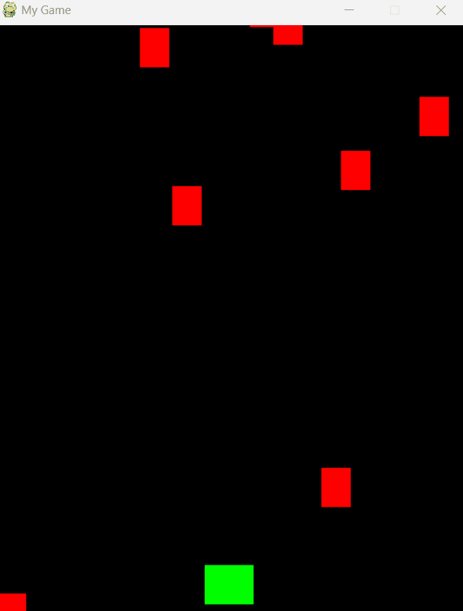
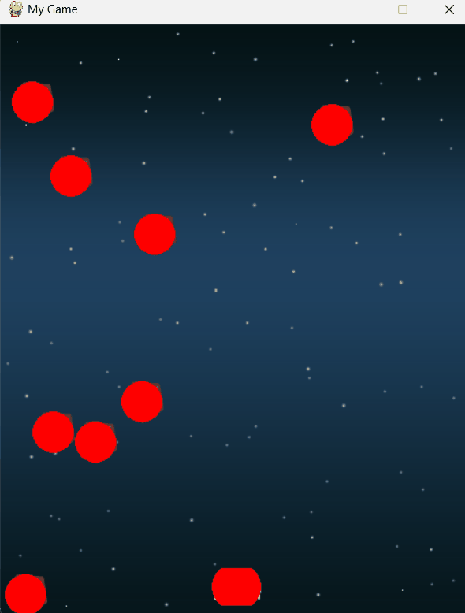

# Pygame in Python

Your first Pygame project! Follow along step-by-step as we build a space shoot-em-up (aka "Shmup"). Each lesson, we'll 
add one feature to the code until we have a fully working game! Some of the things you'll learn how to do:

- Player Controls (keyboard)
- Handling Collisions
- Sprite Animations
- Sound and Music
- Ending the game (and restarting)

## Pygame Lesson 1-1: Getting Started

This is part 1 of our tutorial series, “Game Development with Pygame”. It is intended for beginner/intermediate programmers who are interested in game development and improving their Python coding skills.

You can watch a video version of this lesson here:

[Pygame Lesson 1-1: Getting Started](https://www.youtube.com/watch?v=VO8rTszcW4s)

### What is Pygame?
Pygame is a “game library” - a set of tools to help programmers making games. Some of these things are:

- Graphics and animation
- Sound (including music)
- Control (keyboard, mouse, gamepad, etc.)

### Game Loop
At the heart of every game is a loop, which we call the “Game Loop”. This loop is constantly running, over and over again, doing all the things that are needed to make the game work. Each time the game goes through this loop is called a frame.

Each frame, many different things may happen, but they can be organized into three different categories:


1. **Process Input (or Events)**
This means anything from outside your game that you want to pay attention to - anything that you need the game to respond to. These may be keys being pressed on the keyboard, the mouse being clicked, etc.

2. **Update Game**
This means changing anything that needs to change on this frame. If a character is up in the air, gravity needs to pull it down. If two objects run into each other, they need to explode.

3. **Render (or Draw)**
In this step, we draw everything on the screen. Backgrounds, characters, menus, or anything else that the player needs to see must be drawn on the screen in its correct, updated location.

4. **Clock**
One other important aspect of the loop is controlling how fast the whole loop runs. You may have heard the term FPS, which stands for Frames Per Second. This means how many times per second should this loop happen. This is important because you don’t want your game to run too fast or too slow. You also don’t want it to run at a different speed on different computers - if your character should take 10 seconds to run across the screen, that should be true no matter what computer it’s happening on.

### Building a Pygame Template
Now that we know what pieces we need to make the game work, we can start writing some code. To begin with, we’re going to make a simple pygame program that does nothing but open a window and run a game loop. This will be a great starting point for any pygame project you want to make.

At the top of our program, we’re going to import the libraries we need and set a few variables for our game options:

```
# Pygame template - skeleton for a new pygame projects
import pygame
import random

WIDTH = 360  # width of our game window
HEIGHT = 480  # height of our game window
FPS = 30  # frame per second
```

Next we need to open the game window:

```
# initialize pygame and create window
pygame.init()
pygame.mixer.init()  # for sound
screen = pygame.display.set_mode((WIDTH, HEIGHT))
pygame.display.set_caption("My Game")
clock = pygame.time.Clock()
```

`pygame.init()` is the command to start up pygame and “initialize” it (which is a fancy word for start). `screen` will refer to our game screen, and we create it at the size we set in our configuration constants. Finally, we create a `clock` so that we will be able to make sure our game runs at the FPS we want.

Now it’s time to make the game loop:

```
# Pygame template - skeleton for a new pygame projects
import pygame
import random

WIDTH = 360  # width of our game window
HEIGHT = 480  # height of our game window
FPS = 30  # frame per second

# initialize pygame and create window
pygame.init()
pygame.mixer.init()  # for sound
screen = pygame.display.set_mode((WIDTH, HEIGHT))
pygame.display.set_caption("My Game")
clock = pygame.time.Clock()

# Game Loop
running = True
while running:
    # Process input
    # Update
    # Render (draw)
```

Here is our game loop, which is a `while` loop controlled by the variable `running`. If we ever want the game to end, we just have to set `running` to `False` and the loop will end. Now we can fill in each of the sections with some basic code.

### Render / Draw Section
We’ll start with the Draw section. We don’t have any characters yet, but we can fill the screen with a solid color. To do this, we need to talk about how computers handle color.

Computer screens are made up of pixels, and these pixels have 3 parts to them: red, green, and blue. How much each part is lit up determines what color that pixel is, like this:


You can find the total number of colors a computer can display by multiplying:

```
 >>> 256 * 256 * 256 = 16,777,216
```

Now that we understand colors, let’s define a few at the top of our program:

```
# Colors (R, G, B)
BLACK = (0, 0, 0)
WHITE = (255, 255, 255)
RED = (255, 0, 0)
GREEN = (0, 255, 0)
BLUE = (0, 0, 255)
```

And then we can have our draw section fill the screen.

```
    # Draw / render
    screen.fill(BLACK)
```

However, this isn’t quite enough, because of the way computer displays work. Changing a pixel on the screen means telling the video card to tell the monitor to change the actual pixel. In computer terms, this is a very, very slow process. So if you have a lot of things to draw on the screen, it can take a very long time to draw them all. We can fix this in a clever way by using something called *double-buffering*. This sounds fancy, but it really just means this:

Imagine we had one of those whiteboards that is 2-sided and can flip over to show one side or the other. The front will be the display (the screen the player sees), while the back is hidden and only the computer can “see” it. Every frame, we do all of our drawing on the back side - every character, every bullet, every sparkly light, etc. Then, when we’re done, we flip the board over and show the new frame. This means that we’re only doing that slow process of talking to the display once every frame, and not for every single thing on the screen.

All this happens automatically in pygame. You just have to tell it to flip that whiteboard when you’ve finished drawing. In fact, the command is even named `flip()`:

```
    # Draw / render
    screen.fill(BLACK)
    # *after* drawing everything, flip the display
    pygame.display.flip()
```


Just make sure that you always do `flip()` last. If you try to draw something after the flip, it won’t be seen!

## Input / Events Section
We don’t have a game just yet, so we can’t really say what keys or mouse buttons or other controls we want to listen for. However, there’s one important event that we need to set up. If you tried running the program right now, you’d see that you have a problem: there’s no way to close the window! Clicking on the ‘`X`’ in the corner doesn’t work. That’s because that’s actually an event, and we need to tell our program to listen for that event and have it exit the game.

Events can happen any time. What if the player clicks the ‘jump’ button while the update or draw part of the loop is happening? You don’t want to just ignore that input - the player will be frustrated. So what Pygame does is save up all the events that have happened since the last frame. That way if the player is quickly mashing lots of buttons, you can make sure you know about all of them. This will be a list, so we run a `for` loop to look at all of them:

```
    for event in pygame.event.get():
        # check for closing window
        if event.type == pygame.QUIT:
            running = False
```

Pygame has lots of events that it is able to look for. `pygame.QUIT` is the event that happens when the ‘`X`’ is clicked, so we set `running` to `False` and the game loop will end.

## Controlling FPS
We don’t really have anything to put in the ‘Update’ section yet, but we do still need to make sure we use our FPS setting to control the speed. We can do that like this:

```
while running:
    # keep loop running at the right speed
    clock.tick(FPS)
```

The `tick()` command tells pygame to figure out how long the loop took and then pause for however long it takes to make the whole loop (meaning the whole frame) to last the right amount of time. If we set `FPS` to 30, that means we want a frame to last 1⁄30 or 0.03 seconds. If our loop code (updating, drawing, etc) only takes 0.01 seconds, then pygame will wait for 0.02 seconds, for example.

## Wrapping up
Finally, let’s make sure that when the game loop does end, we actually destroy the game window. We do this by putting `pygame.quit()` at the very end of our code. So our final pygame template looks like this:

```
# Pygame template - skeleton for a new pygame projects
import pygame
import random

WIDTH = 360  # width of our game window
HEIGHT = 480  # height of our game window
FPS = 30  # frame per second

# Define Colors (R, G, B)
BLACK = (0, 0, 0)
WHITE = (255, 255, 255)
RED = (255, 0, 0)
GREEN = (0, 255, 0)
BLUE = (0, 0, 255)

# initialize pygame and create window
pygame.init()
pygame.mixer.init()  # for sound
screen = pygame.display.set_mode((WIDTH, HEIGHT))
pygame.display.set_caption("My Game")
clock = pygame.time.Clock()

# Game Loop
running = True
while running:
    # keep loop running at the right speed
    clock.tick(FPS)

    # Process input
    for event in pygame.event.get():
        # check for closing window
        if event.type == pygame.QUIT:
            running = False

    # Update
    
    # Render (draw)
    screen.fill(BLACK)
    
    # *after* drawing everything, flip display
    pygame.display.flip()
```

Congratulations! You have a working Pygame template. Save this file with a good name, something like `pygame template.py` so that you can re-use this every time you start on a new Pygame project.

In the next tutorial, we’ll use this template as the starting point for learning how to draw objects on the screen and make them move around.

---
---

## Pygame Lesson 1-2: Working with Sprites

This is part 2 of our tutorial series, “Game Development with Pygame”. It is intended for beginner/intermediate programmers who are interested in game development and improving their Python coding skills. You should start with Part 1: Getting Started

You can watch a video version of this lesson here:

[Pygame Lesson 1-2: Working with Sprites](https://www.youtube.com/watch?v=Eltz-XJMxuU)

### What is a sprite?
A *sprite* is a computer graphics term for any object on the screen that can move around. When you play any 2D game, all the objects you see on the screen are sprites. Sprites can be animated, they can be controlled by the player, and they can even interact with each other.

We will take care of updating and drawing our sprites in the `UPDATE` and `DRAW` sections of our game loop. But you can probably imagine, if your game has a large number of sprites then these sections of your game loop could get very long and complicated. Fortunately, Pygame has a good solution for this: the sprite group.

A sprite group is just a collection of sprites that you can act on all at the same time. Let’s make a sprite group to hold all the sprites in our game:

```
 clock = pygame.time.Clock()
 all_sprites = pygame.sprite.Group()
```

Now we can take advantage of the group by adding the following in our loop:

```
    # Update
    all_sprites.update()

    # Draw / render
    screen.fill(BLACK)
    all_sprites.draw(screen)
```

Now for every sprite that we create we just make sure we add it to the `all_sprites` group, and it will automatically be drawn on the screen and updated each time through the loop.

### Creating a sprite
Now we’re ready to make our first sprite. In Pygame, sprites are `objects`. If you haven’t worked with objects in Python before, they are a convenient way of grouping data and code into a single entity. It may be a little confusing at first, but fortunately, Pygame sprites are a good way to practice with objects and get used to how they work.

We start by defining our new sprite:

```
class Player(pygame.sprite.Sprite):
```

`class` tells Python we’re defining a new object, which is going to be our player sprite, and its type is `pygame.sprite.Sprite`, which means it will be based on Pygame’s pre-defined `Sprite` class.

The first bit of code we need in a class definition, is the special `__init__()` function, which defines what code will run whenever a new object of this type is created. There are also two properties that every Pygame sprite *must* have: an `image` and a `rect`:

```
class Player(pygame.sprite.Sprite):
    def __init__(self):
        pygame.sprite.Sprite.__init__(self)
        self.image = pygame.Surface((50, 50))
        self.image.fill(GREEN)
        self.rect = self.image.get_rect()
```

The first line, `pygame.sprite.Sprite.__init__(self)` is required by Pygame - it runs the built-in `Sprite` classes initializer. Next, we define the `image` property - in this case, we’re just creating a simple `50 x 50` square and filling it with the color `GREEN`. Later we’ll learn how to make the sprite’s `image` be something fancier, like a character or spaceship, but a solid square is good enough for now.

Next, we must define the sprite’s `rect`, which is short for “rectangle”. Rectangles are used all over the place in Pygame to keep track of an object’s coordinates. the `get_rect()` command just looks at the `image` and calculates the rectangle that will enclose it.

We can use the `rect` to put the sprite wherever we want it on the screen. Let’s start with the sprite in the center:

```
class Player(pygame.sprite.Sprite):
    def __init__(self):
        pygame.sprite.Sprite.__init__(self)
        self.image = pygame.Surface((50, 50))
        self.image.fill(GREEN)
        self.rect = self.image.get_rect()
        self.rect.center = (WIDTH / 2, HEIGHT / 2)
```

Now that we’ve defined our Player sprite, we need to “spawn” (meaning create) it by making an *instance* of the Player class. We also need to make sure we add the sprite to the `all_sprites` group:

```
all_sprites = pygame.sprite.Group()
player = Player()
all_sprites.add(player)
```

Now, if you run your program, you’ll see the green square at the center of the screen. Go ahead and increase the `WIDTH` and `HEIGHT` settings of your program so that you will have plenty of space for the sprite to move around in the next step.


### Sprite movement
Remember, in the game loop, we have the `all_sprites.update()`. This means that for every sprite in the group, Pygame will look for an `update()` function and run it. So to get our sprite to move, we just need to define its update rules:


```
class Player(pygame.sprite.Sprite):
    def __init__(self):
        pygame.sprite.Sprite.__init__(self)
        self.image = pygame.Surface((50, 50))
        self.image.fill(GREEN)
        self.rect = self.image.get_rect()
        self.rect.center = (WIDTH / 2, HEIGHT / 2)

    def update(self):
        self.rect.x += 5
```

This means that every time through the game loop, we increase the x coordinate of the sprite by 5 pixels. Go ahead and run it and you’ll see the sprite head off the right side of the screen:


Let’s fix that by making the sprite wrap around - whenever it reaches the right side of the screen, we will move it to the left side. We can do this easily by using one of the convenient “handles” on the sprite’s `rect`:


So if the left edge of the `rect` goes off the screen, we’ll set the right edge to 0:

```
class Player(pygame.sprite.Sprite):
    def __init__(self):
        pygame.sprite.Sprite.__init__(self)
        self.image = pygame.Surface((50, 50))
        self.image.fill(GREEN)
        self.rect = self.image.get_rect()
        self.rect.center = (WIDTH / 2, HEIGHT / 2)

    def update(self):
        self.rect.x += 5
        if self.rect.left > WIDTH:
            self.rect.right = 0
```

And now we can see the sprite will appear to wrap around the screen:


That will do it for this lesson. Go ahead and experiment - notice that anything you put in the `update()` method of the sprite will happen every frame. Try making the sprite move up and down (change the y coordinate) or making it bounce off the wall (reverse the direction when the rect reaches the edge).

In the next tutorial, we’ll show you how to use art for your sprite - changing it from a plain square into an animated character.

---
---

# Game Number 1: Shmup (Shoot 'em up) Game!

## Pygame Shmup Part 1: Player Sprite and Controls

Let’s make our first game! In this series of lessons we’ll build a complete game using Python and Pygame. It’s intended for beginning programmers who already understand the basics of Python and are looking to deepen their Python understanding and learn the fundamentals of programming games.

You can watch a video version of this lesson here:

[Player Sprite and Controls](https://youtu.be/nGufy7weyGY)

### Getting started
If you haven’t already, please go back and complete the first lesson on Getting Started with Pygame. We’ll be using the `pygame template.py` program that we built in that lesson as the starting point for this one.

In this series we’ll be making a “Shmup” or “Shoot ‘em up” style game. In our case, we’ll be the pilot of a small spaceship trying to stay alive while meteors and other objects come flying at us.

To begin, save your `pygame template.py` file with a new name. This way you will still have the template when you need it for another new game. I chose to save mine as `shmup.py`.

First, let’s modify the game settings to some good values for the game we’re making:

```
WIDTH = 480
HEIGHT = 600
FPS = 60
```

This is going to be a “portrait mode” game, meaning the height of the window is greater than the width. It’s also an action game, so we want to make sure our FPS is high enough that fast moving sprites will look like they’re moving smoothly. 60 is a good value for this.

### Player sprite
The first thing we’ll add, is a sprite to represent the player. Eventually, this will be a spaceship, but when you’re first starting, it’s simpler to ignore the graphics for a bit and just use plain rectangles for all your sprites. Just focus on getting the sprite on the screen and moving the way you want it to, then you can replace the rectangle with your nice-looking art.

Here is the start for our player sprite:

The diagram


```
class Player(pygame.sprite.Sprite):
    def __init__(self):
        pygame.sprite.Sprite.__init__(self)
        self.image = pygame.Surface((50, 40))
        self.image.fill(GREEN)
        self.rect = self.image.get_rect()
        self.rect.centerx = WIDTH / 2
        self.rect.bottom = HEIGHT - 10
        self.speedx = 0
```

We’ve chosen a size of 50x40 pixels for our player, and we’re locating its `rect` at the bottom center of the screen. We’ve also made a `speedx` property that will keep track of how fast the player is moving in the x direction (side-to-side). If you’re unsure what any of this is doing, please see the earlier lesson on Working with Sprites.

For the `update()` method of our Sprite, which is the code that will happen every frame of the game, we just want to move the sprite at whatever its speed is:

```
    def update(self):
        self.rect.x += self.speedx
```

Now, we can just spawn our sprite to make sure we see it on the screen:

```
all_sprites = pygame.sprite.Group()
player = Player()
all_sprites.add(player)
```

Don’t forget that every sprite you create must be added to the `all_sprites` group so that it will be updated and drawn on the screen.

### Movement / Controls
This is going to be a keyboard controlled game, so we want the player to move when the `Left` or `Right` arrow keys are pressed (you can also use `a` and `d` if you prefer).

We have a choice when we’re thinking about using key presses in our game, which means we are talking about *Events*:

- Option 1: In our event queue we could define two events (one for each key) and each one changes the player’s speed accordingly:

```
    for event in pygame.event.get():
        if event.type == pygame.KEYDOWN:
            if event.key == pygame.K_LEFT:
                player.speedx = -8
            if event.key == pygame.K_RIGHT:
                player.speedx = 8
```

The problem with this method is that while pressing the key will make the Player move, there is no way to stop! We would also need to add two `KEYUP` events that set the speed back to `0`.

- Option 2: We tell the sprite to *always* set its speed to `0`, *unless* the `LEFT` or `RIGHT` key is down. This is will result in smoother movement, as well as being a bit simpler to code:

```
def update(self):
        self.speedx = 0
        keystate = pygame.key.get_pressed()
        if keystate[pygame.K_LEFT]:
            self.speedx = -8
        if keystate[pygame.K_RIGHT]:
            self.speedx = 8
        self.rect.x += self.speedx
```

This sets the `speedx` to `0` every frame, and then checks to see if a key is down. The `pygame.key.get_pressed()` results in a dictionary of every key on the keyboard, with a value of `True` or `False` indicating whether the key is currently down or up. If either of the keys we want are down, we set the speed accordingly.

### Staying on the screen
Finally, we need to make sure that our sprite doesn’t go off the screen. We’re going to add the following to the Player `update():`

```
        if self.rect.right > WIDTH:
            self.rect.right = WIDTH
        if self.rect.left < 0:
            self.rect.left = 0
```

Now if the `rect` ever tries to move to a position that is past the left or right edges of the screen, it will stop. Another option would be to wrap around the screen - teleporting the sprite from one side to the other when it hits the edge - but for this game, stopping on the edges feels more appropriate.

### Wrapping up
Here is the full code for this step:

```
# Pygame template - skeleton for a new pygame projects
import pygame
import random

WIDTH = 480  # width of our game window
HEIGHT = 600  # height of our game window
FPS = 60  # frame per second

# Define Colors (R, G, B)
BLACK = (0, 0, 0)
WHITE = (255, 255, 255)
RED = (255, 0, 0)
GREEN = (0, 255, 0)
BLUE = (0, 0, 255)

# for Sprite class
class Player(pygame.sprite.Sprite):
    def __init__(self):
        pygame.sprite.Sprite.__init__(self)
        self.image = pygame.Surface((50, 40))
        self.image.fill(GREEN)
        self.rect = self.image.get_rect()
        self.rect.centerx = WIDTH/2
        self.rect.bottom = HEIGHT - 10
        self.speedx = 0

    def update(self):
        self.speedx = 0
        keystate = pygame.key.get_pressed()
        if keystate[pygame.K_LEFT]:
            self.speedx -= 8
        if keystate[pygame.K_RIGHT]:
            self.speedx += 8
        self.rect.x += self.speedx
        if self.rect.right > WIDTH:
            self.rect.right = WIDTH
        if self.rect.left < 0:
            self.rect.left = 0

# initialize pygame and create window
pygame.init()
pygame.mixer.init()  # for sound
screen = pygame.display.set_mode((WIDTH, HEIGHT))
pygame.display.set_caption("My Game")
clock = pygame.time.Clock()

# spawn the sprite
all_sprites = pygame.sprite.Group()
player = Player()
all_sprites.add(player)

# Game Loop
running = True
while running:
    # keep loop running at the right speed
    clock.tick(FPS)

    # Process input
    for event in pygame.event.get():
        # check for closing window
        if event.type == pygame.QUIT:
            running = False

    # Update
    all_sprites.update()

    # Render (draw)
    screen.fill(BLACK)
    all_sprites.draw(screen)

    # *after* drawing everything, flip display
    pygame.display.flip()
```

Test it as the result of the full code:


## Pygame Shmup Part 2: Enemy Sprites

This is part 2 of our “Shmup” project! In this lesson we’ll add some enemy sprites for our player to dodge. In this series of lessons we’ll build a complete game using Python and Pygame. It’s intended for beginning programmers who already understand the basics of Python and are looking to deepen their Python understanding and learn the fundamentals of programming games.

[Pygame Shmup Part 2: Enemy Sprites](https://youtu.be/-5GNbL33hz0)

### Enemy Sprites
At this point, we don’t need to worry about what our enemy sprites are, we just want to get them on the screen. You might decide your game is about a spaceship dodging meteors or a unicorn dodging flying pizzas - as far as the code is concerned, it doesn’t matter.

Keeping that in mind, we’re going to name our enemy sprite in the code something generic. It turns out there’s a perfect word for generic objects that move around in your game (a term you may have heard before): `Mob`.

We’ll start by defining the sprite properties:

```
class Mob(pygame.sprite.Sprite):
    def __init__(self):
        pygame.sprite.Sprite.__init__(self)
        self.image = pygame.Surface((30, 40))
        self.image.fill(RED)
        self.rect = self.image.get_rect()
        self.rect.x = random.randrange(WIDTH - self.rect.width)
        self.rect.y = random.randrange(-100, -40)
        self.speedy = random.randrange(1, 8)
```

The key here is picking a good spot for the mobs to spawn. We don’t want them to just pop into existence, so we pick a y value that will be above the top `(y < 0)` and a random value for x that is somewhere between the sides.

Now, for the update, we can move the sprite by its speedy, but what about when the sprite goes off the bottom? We could delete the sprite, and then spawn another one, or we could get the exact same effect by moving the sprite back to a random position above the top:

```
def update(self):
        self.rect.y += self.speedy
        if self.rect.top > HEIGHT + 10:
            self.rect.x = random.randrange(WIDTH - self.rect.width)
            self.rect.y = random.randrange(-100, -40)
            self.speedy = random.randrange(1, 8)
```

### Spawning Enemies
We are going to want to have many enemies, so we’re going to make a new group called `mobs` to hold them all. This is also going to make our lives easier in later steps. Then we spawn a number of mobs and add them to the groups:

```
player = Player()
all_sprites.add(player)
for i in range(8):
    m = Mob()
    all_sprites.add(m)
    mobs.add(m)
```

Now you should have a steady stream of mobs coming down the screen, like this:


This is great, but it’s a little boring to just have the mobs all moving straight down. Let’s add a little bit of movement in the x direction as well:

```
class Mob(pygame.sprite.Sprite):
    def __init__(self):
        pygame.sprite.Sprite.__init__(self)
        self.image = pygame.Surface((30, 40))
        self.image.fill(RED)
        self.rect = self.image.get_rect()
        self.rect.x = random.randrange(WIDTH - self.rect.width)
        self.rect.y = random.randrange(-100, -40)
        self.speedy = random.randrange(1, 8)
        self.speedx = random.randrange(-3, 3)

    def update(self):
        self.rect.x += self.speedx
        self.rect.y += self.speedy
        if self.rect.top > HEIGHT + 10 or self.rect.left < -25 or self.rect.right > WIDTH + 20:
            self.rect.x = random.randrange(WIDTH - self.rect.width)
            self.rect.y = random.randrange(-100, -40)
            self.speedy = random.randrange(1, 8)
```

Note that we needed to change the `if` statement that respawns the mob when it goes offscreen. A mob moving diagonally will go off the side long before it goes off the bottom, so this way we are sure to reset it relatively quickly.

Your game should now look like this:



In the next lesson, we’ll learn how to detect when two sprites run into each other (collide) and enable the player to shoot back at the mobs.

### The Full Code for this topic

```
# Pygame template - skeleton for a new pygame projects
import pygame
import random

WIDTH = 480  # width of our game window
HEIGHT = 600  # height of our game window
FPS = 60  # frame per second

# Define Colors (R, G, B)
BLACK = (0, 0, 0)
WHITE = (255, 255, 255)
RED = (255, 0, 0)
GREEN = (0, 255, 0)
BLUE = (0, 0, 255)

# for Sprite class
class Player(pygame.sprite.Sprite):
    def __init__(self):
        pygame.sprite.Sprite.__init__(self)
        self.image = pygame.Surface((50, 40))
        self.image.fill(GREEN)
        self.rect = self.image.get_rect()
        self.rect.centerx = WIDTH/2
        self.rect.bottom = HEIGHT - 10
        self.speedx = 0

    def update(self):
        self.speedx = 0
        keystate = pygame.key.get_pressed()
        if keystate[pygame.K_LEFT]:
            self.speedx -= 8
        if keystate[pygame.K_RIGHT]:
            self.speedx += 8
        self.rect.x += self.speedx
        if self.rect.right > WIDTH:
            self.rect.right = WIDTH
        if self.rect.left < 0:
            self.rect.left = 0

# Enemy class
class Mob(pygame.sprite.Sprite):
    def __init__(self):
        pygame.sprite.Sprite.__init__(self)
        self.image = pygame.Surface((30, 40))
        self.image.fill(RED)
        self.rect = self.image.get_rect()
        self.rect.x = random.randrange(WIDTH - self.rect.width)
        self.rect.y = random.randrange(-100, -40)
        self.speedy = random.randrange(1, 8)
        self.speedx = random.randrange(-3, 3)

    def update(self):
        self.rect.x += self.speedx
        self.rect.y += self.speedy
        if self.rect.top > HEIGHT + 10 or self.rect.left < -25 or self.rect.right > WIDTH + 20:
            self.rect.x = random.randrange(WIDTH - self.rect.width)
            self.rect.y = random.randrange(-100, -40)
            self.speedy = random.randrange(1, 8)

# initialize pygame and create window
pygame.init()
pygame.mixer.init()  # for sound
screen = pygame.display.set_mode((WIDTH, HEIGHT))
pygame.display.set_caption("My Game")
clock = pygame.time.Clock()

# spawn the sprite
all_sprites = pygame.sprite.Group()
mobs = pygame.sprite.Group()
player = Player()
all_sprites.add(player)

for i in range(8):
    m = Mob()
    all_sprites.add(m)
    mobs.add(m)

# Game Loop
running = True
while running:
    # keep loop running at the right speed
    clock.tick(FPS)

    # Process input
    for event in pygame.event.get():
        # check for closing window
        if event.type == pygame.QUIT:
            running = False

    # Update
    all_sprites.update()
    mobs.update()

    # Render (draw)
    screen.fill(BLACK)
    all_sprites.draw(screen)

    # *after* drawing everything, flip display
    pygame.display.flip()
```

## Pygame Shmup Part 3: Collisions (and shooting!)

This is part 3 of our “Shmup” project! In this lesson we’ll add collisions between the player and the enemies, as well as adding bullets for the player to shoot.

### About this series
In this series of lessons we’ll build a complete game using Python and Pygame. It’s intended for beginning programmers who already understand the basics of Python and are looking to deepen their Python understanding and learn the fundamentals of programming games.

[Pygame Shmup Part 3: Collisions](https://youtu.be/33g62PpFwsE)

## Collisions
Collisions are a fundamental part of game development. *Collision detection* means that you want to detect whether one object in the game world is touching another object. *Collision response* is deciding what you want to happen when the collision occurs - does Mario pick up the coin, does Link’s sword damage the enemy, etc.

In our game we currently have a number of enemy sprites flying down the screen towards our player, and we’d like to know when one of those sprites hits. For this stage of our game, we’ll just say that an enemy hitting the player means the game is over.

### Bounding boxes

Remember, each sprite in Pygame has a `rect` attribute that defines its coordinates and its size. A Rect object in Pygame is in the format `[x, y, width, height]`, where `x` and `y` represent the upper left corner of the rectangle. Another word for this rectangle is *bounding box*, because it represents the bounds of the object.

This kind of collision detection is called **AABB**, which stands for `“Axis Aligned Bounding Box”`, because the rectangles are aligned with the screen axes - they’re not tilted at an angle. AABB collision is very popular because it’s *fast* - the computer can compare the coordinates of rectangles very quickly, which is very helpful if you have a large number of objects to compare.

To detect a collision we need to look at the `rect` of the player and compare it with the `rect` of each of the mobs. Now we could do this by looping through the mobs and for each one performing this comparison:


In this picture, you can see that only rectangle #3 is colliding with the large black rectangle. #1 is overlapping in the x axis, but not the y; #2 is overlapping in y, but not in x. In order for two rectangles to be overlapping, their *bounds* must overlap in each axis. Writing this in code:

```
if mob.rect.right > player.rect.left and \
   mob.rect.left < player.rect.right and \
   mob.rect.bottom > player.rect.top and \
   mob.rect.top < player.rect.bottom:
       collide = True
```

Fortunately for us, Pygame has a built-in way of doing the above, by using the `spritecollide()` function.

## Colliding mobs with player
We’re going to add this command to the “update” section of our game loop:

```
#Update
all_sprites.update()

#check to see if a mob hit the player
hits = pygame.sprite.spritecollide(player, mobs, False)
if hits:
    running = False
```

The s`pritecollide()` function takes 3 arguments: the name of the sprite you want to check, the name of a *group* you want to compare against, and a True/False parameter called `dokill`. The `dokill` parameter lets you set whether the object should be deleted when it gets hit. If, for example, we were trying to see if the player picked up a coin, we would want to set this to `True` so the coin would disappear.

The result of the `spritecollide()` command is a list of the sprites that were hit (remember, it’s possible the player collided with more than one mob at a time). We’re assigning that list to the variable `hits`.

If the `hits` list is not empty, the `if` statement will be `True`, and we set running to `False` so the game will end.

## Shooting back
### Bullet sprite
Now we’re ready to add a new sprite: the bullet. This will be a sprite that is spawned when we shoot, appears at the top of the player sprite, and moves upwards at some fairly high speed. Defining a sprite should be starting to look familiar to you by now, so here’s the complete `Bullet` class:

```
class Bullet(pygame.sprite.Sprite):
    def __init__(self, x, y):
        pygame.sprite.Sprite.__init__(self)
        self.image = pygame.Surface((10, 20))
        self.image.fill(YELLOW)
        self.rect = self.image.get_rect()
        self.rect.bottom = y
        self.rect.centerx = x
        self.speedy = -10

    def update(self):
        self.rect.y += self.speedy
        # kill if it moves off the top of the screen
        if self.rect.bottom < 0:
            self.kill()
```

In the `__init__()` method of the bullet sprite, we’re passing `x` and `y` values, so that we can tell the sprite where to appear. Since the player sprite can move, this will be set to where the player is at the time the player shoots. We set `speedy` to a negative value, so that it will be going upward.

Finally, we check to see if the bullet has gone off the top of the screen, and if so, we delete it.

### Keypress event
To keep things simple at first, we’re going to make it so that each time the player presses the spacebar, a bullet will be fired. We need to add that to the events checking:

```
for event in pygame.event.get():
    # check for closing window
    if event.type == pygame.QUIT:
        running = False
    elif event.type == pygame.KEYDOWN:
        if event.key == pygame.K_SPACE:
            player.shoot()
```

Our new code checks for a `KEYDOWN` event, and if there is one, checks to see if it was the `K_SPACE` key. If it was, we’re going to run the player sprite’s `shoot()` method.

### Spawning the bullet
First we need to add a new group to hold all of the bullets:

```
bullets = pygame.sprite.Group()
```

Now, we can add the following method to the `Player` class:

```
def shoot(self):
    bullet = Bullet(self.rect.centerx, self.rect.top)
    all_sprites.add(bullet)
    bullets.add(bullet)
```

All the `shoot()` method does is spawn a bullet, using the top center of the player as the spawn point. Then we make sure to add the bullet to `all_sprites` (so it will be drawn and updated) and to `bullets`, which we’re going to use for the collisions.

### Bullet collisions
Now we need to check whether a bullet hits a mob. The difference here is we have multiple bullets (in the `bullets` group) and multiple mobs (in the `mobs` group), so we can’t use `spritecollide()` like before because that only compares one sprite against a group. Instead, we’re going to use `groupcollide()`:

```
# Update
all_sprites.update()

# check to see if a bullet hit a mob
hits = pygame.sprite.groupcollide(mobs, bullets, True, True)
for hit in hits:
    m = Mob()
    all_sprites.add(m)
    mobs.add(m)
```

The `groupcollide()` function is similar to `spritecollide()`, except that you name two groups to compare, and what you will get back is a list of mobs that were hit. There are two `dokill` options, one for each of the groups.

If we just delete the mobs, we’ll have a problem: running out of mobs! So what we do is loop through `hits` and for each mob that we destroy, another new one will be spawned.


### The Full Code

```
# Pygame template - skeleton for a new pygame projects
import pygame
import random

WIDTH = 480  # width of our game window
HEIGHT = 600  # height of our game window
FPS = 60  # frame per second

# Define Colors (R, G, B)
BLACK = (0, 0, 0)
WHITE = (255, 255, 255)
RED = (255, 0, 0)
GREEN = (0, 255, 0)
BLUE = (0, 0, 255)
YELLOW = (255, 255, 0)

# for Sprite class
class Player(pygame.sprite.Sprite):
    def __init__(self):
        pygame.sprite.Sprite.__init__(self)
        self.image = pygame.Surface((50, 40))
        self.image.fill(GREEN)
        self.rect = self.image.get_rect()
        self.rect.centerx = WIDTH/2
        self.rect.bottom = HEIGHT - 10
        self.speedx = 0

    def update(self):
        self.speedx = 0
        keystate = pygame.key.get_pressed()
        if keystate[pygame.K_LEFT]:
            self.speedx -= 8
        if keystate[pygame.K_RIGHT]:
            self.speedx += 8
        self.rect.x += self.speedx
        if self.rect.right > WIDTH:
            self.rect.right = WIDTH
        if self.rect.left < 0:
            self.rect.left = 0

    def shoot(self):
        bullet = Bullet(self.rect.centerx, self.rect.top)
        all_sprites.add(bullet)
        bullets.add(bullet)

# Enemy class
class Mob(pygame.sprite.Sprite):
    def __init__(self):
        pygame.sprite.Sprite.__init__(self)
        self.image = pygame.Surface((30, 40))
        self.image.fill(RED)
        self.rect = self.image.get_rect()
        self.rect.x = random.randrange(WIDTH - self.rect.width)
        self.rect.y = random.randrange(-100, -40)
        self.speedy = random.randrange(1, 8)
        self.speedx = random.randrange(-3, 3)

    def update(self):
        self.rect.x += self.speedx
        self.rect.y += self.speedy
        if self.rect.top > HEIGHT + 10 or self.rect.left < -25 or self.rect.right > WIDTH + 20:
            self.rect.x = random.randrange(WIDTH - self.rect.width)
            self.rect.y = random.randrange(-100, -40)
            self.speedy = random.randrange(1, 8)

# For bullet sprite
class Bullet(pygame.sprite.Sprite):
    def __init__(self, x, y):
        pygame.sprite.Sprite.__init__(self)
        self.image = pygame.Surface((10, 20))
        self.image.fill(YELLOW)
        self.rect = self.image.get_rect()
        self.rect.bottom = y
        self.rect.centerx = x
        self.speedy = -10
    
    def update(self):
        self.rect.y += self.speedy
        # kill if it moves off the top of the screen
        if self.rect.bottom < 0:
            self.kill

# initialize pygame and create window
pygame.init()
pygame.mixer.init()  # for sound
screen = pygame.display.set_mode((WIDTH, HEIGHT))
pygame.display.set_caption("My Game")
clock = pygame.time.Clock()

# spawn the sprite
all_sprites = pygame.sprite.Group()
mobs = pygame.sprite.Group()
bullets = pygame.sprite.Group()

player = Player()
all_sprites.add(player)

for i in range(8):
    m = Mob()
    all_sprites.add(m)
    mobs.add(m)

# Game Loop
running = True
while running:
    # keep loop running at the right speed
    clock.tick(FPS)

    # Process input
    for event in pygame.event.get():
        # check for closing window
        if event.type == pygame.QUIT:
            running = False
        elif event.type == pygame.KEYDOWN:
            if event.key == pygame.K_SPACE:
                player.shoot()

    # Update
    all_sprites.update()

    # check to see if a bullet hit a mob
    hits = pygame.sprite.groupcollide(mobs, bullets, True, True)
    for hit in hits:
        m = Mob()
        all_sprites.add(m)
        mobs.add(m)

    # check to see if a mob hit the player
    hits = pygame.sprite.spritecollide(player, mobs, False)
    if hits:
        running = False

    # Render (draw)
    screen.fill(BLACK)
    all_sprites.draw(screen)

    # *after* drawing everything, flip display
    pygame.display.flip()
```

## Pygame Shmup Part 4: Adding Graphics

This is part 4 of our “Shmup” project. If you haven’t already read through the previous parts, please start with Part 1. In this lesson we’ll discuss how to use pre-drawn graphics in our game.

### About this series
In this series of lessons we’ll build a complete game using Python and Pygame. It’s intended for beginning programmers who already understand the basics of Python and are looking to deepen their Python understanding and learn the fundamentals of programming games.

[Pygame Shmup Part 4: Adding Graphics](https://youtu.be/mOckdKp3V38)

## Choosing Graphics
In our Intro lesson about sprites, we talked about [Opengameart.org](http://opengameart.org/), a great source of free game art, and one of our favorite artists there, Kenney. Kenney has made the perfect art pack for our game, the “Space Shooter Pack”, which you can find here:

[http://opengameart.org/content/space-shooter-redux](https://opengameart.org/content/space-shooter-redux)

It has lots of really great-looking images, including spaceships, lasers, asteroids, and more.

When you download the pack, it will unzip into a bunch of different folders. What we want is the PNG folder, which has all the individual images. We’re going choose three images for our three sprites, as well as a “starfield” image I’ve included to use for our game background.


These images need to be copied to a place where our game can find them. The easiest way to do this is to make a new folder in the same location where your game code is. We’ve named our folder “img”.

### Loading images
As we discussed in the Introduction to Sprites lesson, in order to make sure our code will work on any operating system, we need to use the `os.path` function to take care of figuring out the correct location and path for our files. At the top of our program we’ll define where our img folder is:

```
from os import path

img_dir = path.join(path.dirname(__file__), 'img')
```

### Drawing the background
Now, we can start by loading the background image. We’ll do all our asset loading before our existing game loop and initialization code:

```
# Load all game graphics
background = pygame.image.load(path.join(img_dir, 'starfield.png')).convert()
background_rect = background.get_rect()
```
or this if the file is relative without using `os` library

```
background = pygame.image.load('starfield.png')
background_rect = background.get_rect()
```
Now we can draw our background in the draw section of our game loop before we draw any of the sprites:

```
# Draw / render
screen.fill(BLACK)
screen.blit(background, background_rect)
all_sprites.draw(screen)
```

`blit` is an old-school computer graphics term that means to draw the pixels of one image onto the pixels of another 
image - in this case the background onto the screen. Now our background looks much nicer:


### Sprite images
Now we can load the images for our sprites:

```
# Load all game graphics
background = pygame.image.load(path.join(img_dir, 'starfield.png')).convert()
background_rect = background.get_rect()
player_img = pygame.image.load(path.join(img_dir, "playerShip1_orange.png")).convert()
meteor_img = pygame.image.load(path.join(img_dir, "meteorBrown_med1.png")).convert()
bullet_img = pygame.image.load(path.join(img_dir, "laserRed16.png")).convert()
```

or without `os` library if relative file:

```
background = pygame.image.load('starfield.png')
background_rect = background.get_rect()
player_img = pygame.image.load('playerShip1_orange.png')
meteor_img = pygame.image.load('meteorBrown_med1.png')
bullet_img = pygame.image.load('laserRed16.png')
```

Starting with the player - we want to replace that green rectangle, so we change the `self.image`, and don’t forget to 
remove the `image.fill(GREEN)`, which we no longer need:

```
class Player(pygame.sprite.Sprite):
    def __init__(self):
        pygame.sprite.Sprite.__init__(self)
        self.image = player_img
        self.rect = self.image.get_rect()
```

However, now we see a couple of problems. First, the image is a lot bigger than we’d like it to be. We have two 
options: 1) open the image in a graphics editor (Photoshop, GIMP, etc) and resize it; or 2) resize the image in our code. 
We’ll choose option 2, using Pygame’s `transform.scale()` command to make the image about half the size, which would 
be 50x30 pixels.

The other problem is that our ship has a black rectangle around it because we didn’t set the transparent color 
using `set_colorkey`:

```
self.image = pygame.transform.scale(player_img, (50, 38))
self.image.set_colorkey(BLACK)
```

If we follow the same procedure with our `Bullet` and `Mob` classes (although we don’t need to scale them), we will 
wind up with a much nicer looking game:


### Wrapping up
Now that we have our graphics in place, you may have noticed a new problem: sometimes the meteors destroy our ship even 
when it doesn’t look like they are touching. Try it yourself - how frustrating! In the next lesson, we’ll look at how 
to adjust the collisions so work correctly.

```
# Pygame template - skeleton for a new pygame projects
import pygame
import random

WIDTH = 480  # width of our game window
HEIGHT = 600  # height of our game window
FPS = 60  # frame per second

# Define Colors (R, G, B)
BLACK = (0, 0, 0)
WHITE = (255, 255, 255)
RED = (255, 0, 0)
GREEN = (0, 255, 0)
BLUE = (0, 0, 255)
YELLOW = (255, 255, 0)


# for Sprite class
class Player(pygame.sprite.Sprite):
    def __init__(self):
        pygame.sprite.Sprite.__init__(self)
        self.image = pygame.transform.scale(player_img, (50, 38))
        self.image.set_colorkey(BLACK)
        self.rect = self.image.get_rect()
        self.rect.centerx = WIDTH / 2
        self.rect.bottom = HEIGHT - 10
        self.speedx = 0

    def update(self):
        self.speedx = 0
        keystate = pygame.key.get_pressed()
        if keystate[pygame.K_LEFT]:
            self.speedx -= 8
        if keystate[pygame.K_RIGHT]:
            self.speedx += 8
        self.rect.x += self.speedx
        if self.rect.right > WIDTH:
            self.rect.right = WIDTH
        if self.rect.left < 0:
            self.rect.left = 0

    def shoot(self):
        bullet = Bullet(self.rect.centerx, self.rect.top)
        all_sprites.add(bullet)
        bullets.add(bullet)


# Enemy class
class Mob(pygame.sprite.Sprite):
    def __init__(self):
        pygame.sprite.Sprite.__init__(self)
        self.image = meteor_img
        self.image.set_colorkey(BLACK)
        self.rect = self.image.get_rect()
        self.rect.x = random.randrange(WIDTH - self.rect.width)
        self.rect.y = random.randrange(-100, -40)
        self.speedy = random.randrange(1, 8)
        self.speedx = random.randrange(-3, 3)

    def update(self):
        self.rect.x += self.speedx
        self.rect.y += self.speedy
        if self.rect.top > HEIGHT + 10 or self.rect.left < -25 or self.rect.right > WIDTH + 20:
            self.rect.x = random.randrange(WIDTH - self.rect.width)
            self.rect.y = random.randrange(-100, -40)
            self.speedy = random.randrange(1, 8)


# For bullet sprite
class Bullet(pygame.sprite.Sprite):
    def __init__(self, x, y):
        pygame.sprite.Sprite.__init__(self)
        self.image = bullet_img
        self.rect = self.image.get_rect()
        self.rect.bottom = y
        self.rect.centerx = x
        self.speedy = -10

    def update(self):
        self.rect.y += self.speedy
        # kill if it moves off the top of the screen
        if self.rect.bottom < 0:
            self.kill


# Load all game graphics
background = pygame.image.load('starfield.png')
background_rect = background.get_rect()
player_img = pygame.image.load('playerShip1_orange.png')
meteor_img = pygame.image.load('meteorBrown_med1.png')
bullet_img = pygame.image.load('laserRed16.png')

# initialize pygame and create window
pygame.init()
pygame.mixer.init()  # for sound
screen = pygame.display.set_mode((WIDTH, HEIGHT))
pygame.display.set_caption("My Game")
clock = pygame.time.Clock()

# spawn the sprite
all_sprites = pygame.sprite.Group()
mobs = pygame.sprite.Group()
bullets = pygame.sprite.Group()

player = Player()
all_sprites.add(player)

for i in range(8):
    m = Mob()
    all_sprites.add(m)
    mobs.add(m)

# Game Loop
running = True
while running:
    # keep loop running at the right speed
    clock.tick(FPS)

    # Process input
    for event in pygame.event.get():
        # check for closing window
        if event.type == pygame.QUIT:
            running = False
        elif event.type == pygame.KEYDOWN:
            if event.key == pygame.K_SPACE:
                player.shoot()

    # Update
    all_sprites.update()

    # check to see if a bullet hit a mob
    hits = pygame.sprite.groupcollide(mobs, bullets, True, True)
    for hit in hits:
        m = Mob()
        all_sprites.add(m)
        mobs.add(m)

    # check to see if a mob hit the player
    hits = pygame.sprite.spritecollide(player, mobs, False)
    if hits:
        running = False

    # Render (draw)
    screen.fill(BLACK)
    screen.blit(background, background_rect)
    all_sprites.draw(screen)

    # *after* drawing everything, flip display
    pygame.display.flip()
```

## Pygame Shmup Part 5: Improved Collisions

This is part 5 of our “Shmup” project. If you haven’t already read through the previous parts, please start with Part 1. 
In this lesson we’ll discuss how to change the way Pygame handles collisions between sprites.

### About this series
In this series of lessons we’ll build a complete game using Python and Pygame. It’s intended for beginning programmers 
who already understand the basics of Python and are looking to deepen their Python understanding and learn the 
fundamentals of programming games.

[Pygame Shmup Part 5: Improved Collisions](https://youtu.be/_y5U8tB36Vk)

## What’s going on with our collisions?
In the previous video we added graphics, changing our sprites from plain rectangles to nicer-looking PNG images. 
However, this has introduced a problem: sometimes the game counts a collision between the player and a meteor when it 
doesn’t look like they hit at all. To understand what’s going on, let’s look at a diagram:


The default type of collision in Pygame is using the `collide_rect()` function, which uses the two sprites’ `rect` 
attributes to calculate whether they overlap. This is called *AABB* collision and it’s very fast and reliable. However, 
if the sprite images are not rectangles then you get a situation like in the picture. The rectangles overlap, so 
`collide_rect()` is True, but the player will feel frustrated, because they feel like they should have successfully dodged 
the meteor.

If you find yourself in this situation, there are a few things you can try:


By using the `collide_rect_ratio()` function instead, you can use a smaller rectangle, reducing the amount of “empty” 
space that could count as an overlap. Depending on the shape of the sprite, this can work quite well. Notice in the 
image above how the tips of the ship’s wings are outside the rect. This means that in some cases the meteor will appear 
to go through the wing without counting as a hit. This is actually a good situation! At the speed things are moving in 
the game, the player won’t notice this directly, but will just feel like they “got away with” a really close dodge. 
Instead of feeling frustrated, they will feel like they are doing really well.


Another option is to use a circular bounding box. In the case of the meteor, this is a perfect fit. It doesn’t fit 
the ship quite as well, but again the wings being outside the collision won’t be a negative thing.

### Setting the sprite’s radius
Based on the options above, we’re going to choose circles for our meteor vs. player collisions. Pygame makes this easy 
to do - we just need to set a new attribute on each of our sprites: `self.radius`.

Let’s start with the player. How big should be make the collision circle? It can take a little bit of experimentation 
to get the right value. Here’s how to do that, in the player sprite’s `__init()__`:

```
	self.rect = self.image.get_rect()
	self.radius = 25
	pygame.draw.circle(self.image, RED, self.rect.center, self.radius)
```

We are drawing a red circle on top of the player image so that we can see how it looks. Let’s do the same for the meteor:

```
	self.rect = self.image.get_rect()
	self.radius = int(self.rect.width / 2)
	pygame.draw.circle(self.image, RED, self.rect.center, self.radius)
```

In this case, we are planning ahead a little bit. We may decide to use different sized meteor images. By setting the 
radius to 1⁄2 of the width of the image, we can do that without having to adjust the code later.

Here is what we end up with:



You can see we probably have too large a radius for the player sprite - it’s actually bigger in the y axis than the 
size of the ship. To get closer to the example above, let’s set `self.radius = 20` on the player.

For the meteor, we’d like a little bit of the corners to stick out, so let’s scale the circle to 85% of the size:

```
	self.radius = int(self.rect.width * .85 / 2)
```


Once you have tried it out and you’re happy with how the collisions are working, you can remove the red circles. 
I recommend you just comment the commands out rather than deleting them, in case you ever want to use them again in 
the future.

### Wrapping up
Deciding on the right collision style can make a big difference in how your game feels. We have a much better 
meteor vs. player collision now, but notice that we did not change the bullet vs. meteor collision style. Circles would 
be a bad choice for the shape of the bullets, so it’s better to leave them as rectangles.

### The Full Code

```
# Pygame template - skeleton for a new pygame projects
import pygame
import random

WIDTH = 480  # width of our game window
HEIGHT = 600  # height of our game window
FPS = 60  # frame per second

# Define Colors (R, G, B)
BLACK = (0, 0, 0)
WHITE = (255, 255, 255)
RED = (255, 0, 0)
GREEN = (0, 255, 0)
BLUE = (0, 0, 255)
YELLOW = (255, 255, 0)


# for Sprite class
class Player(pygame.sprite.Sprite):
    def __init__(self):
        pygame.sprite.Sprite.__init__(self)
        self.image = pygame.transform.scale(player_img, (50, 38))
        self.image.set_colorkey(BLACK)
        self.rect = self.image.get_rect()
        self.radius = 20
        # pygame.draw.circle(self.image, RED, self.rect.center, self.radius)
        self.rect.centerx = WIDTH / 2
        self.rect.bottom = HEIGHT - 10
        self.speedx = 0

    def update(self):
        self.speedx = 0
        keystate = pygame.key.get_pressed()
        if keystate[pygame.K_LEFT]:
            self.speedx -= 8
        if keystate[pygame.K_RIGHT]:
            self.speedx += 8
        self.rect.x += self.speedx
        if self.rect.right > WIDTH:
            self.rect.right = WIDTH
        if self.rect.left < 0:
            self.rect.left = 0

    def shoot(self):
        bullet = Bullet(self.rect.centerx, self.rect.top)
        all_sprites.add(bullet)
        bullets.add(bullet)


# Enemy class
class Mob(pygame.sprite.Sprite):
    def __init__(self):
        pygame.sprite.Sprite.__init__(self)
        self.image = meteor_img
        self.image.set_colorkey(BLACK)
        self.rect = self.image.get_rect()
        self.radius = int(self.rect.width * .85 / 2)
        # pygame.draw.circle(self.image, RED, self.rect.center, self.radius)
        self.rect.x = random.randrange(WIDTH - self.rect.width)
        self.rect.y = random.randrange(-100, -40)
        self.speedy = random.randrange(1, 8)
        self.speedx = random.randrange(-3, 3)

    def update(self):
        self.rect.x += self.speedx
        self.rect.y += self.speedy
        if self.rect.top > HEIGHT + 10 or self.rect.left < -25 or self.rect.right > WIDTH + 20:
            self.rect.x = random.randrange(WIDTH - self.rect.width)
            self.rect.y = random.randrange(-100, -40)
            self.speedy = random.randrange(1, 8)


# For bullet sprite
class Bullet(pygame.sprite.Sprite):
    def __init__(self, x, y):
        pygame.sprite.Sprite.__init__(self)
        self.image = bullet_img
        self.rect = self.image.get_rect()
        self.rect.bottom = y
        self.rect.centerx = x
        self.speedy = -10

    def update(self):
        self.rect.y += self.speedy
        # kill if it moves off the top of the screen
        if self.rect.bottom < 0:
            self.kill


# Load all game graphics
background = pygame.image.load('starfield.png')
background_rect = background.get_rect()
player_img = pygame.image.load('playerShip1_orange.png')
meteor_img = pygame.image.load('meteorBrown_med1.png')
bullet_img = pygame.image.load('laserRed16.png')

# initialize pygame and create window
pygame.init()
pygame.mixer.init()  # for sound
screen = pygame.display.set_mode((WIDTH, HEIGHT))
pygame.display.set_caption("My Game")
clock = pygame.time.Clock()

# spawn the sprite
all_sprites = pygame.sprite.Group()
mobs = pygame.sprite.Group()
bullets = pygame.sprite.Group()

player = Player()
all_sprites.add(player)

for i in range(8):
    m = Mob()
    all_sprites.add(m)
    mobs.add(m)

# Game Loop
running = True
while running:
    # keep loop running at the right speed
    clock.tick(FPS)

    # Process input
    for event in pygame.event.get():
        # check for closing window
        if event.type == pygame.QUIT:
            running = False
        elif event.type == pygame.KEYDOWN:
            if event.key == pygame.K_SPACE:
                player.shoot()

    # Update
    all_sprites.update()

    # check to see if a bullet hit a mob
    hits = pygame.sprite.groupcollide(mobs, bullets, True, True)
    for hit in hits:
        m = Mob()
        all_sprites.add(m)
        mobs.add(m)

    # check to see if a mob hit the player
    hits = pygame.sprite.spritecollide(player, mobs, False, pygame.sprite.collide_circle)
    if hits:
        running = False

    # Render (draw)
    screen.fill(BLACK)
    screen.blit(background, background_rect)
    all_sprites.draw(screen)

    # *after* drawing everything, flip display
    pygame.display.flip()
```

## Pygame Shmup Part 6: Sprite Animation

This is part 6 of our “Shmup” project. If you haven’t already read through the previous parts, please start with Part 1. 
In this lesson we’ll make our meteors more interesting by adding a little bit of sprite animation.

### About this series
In this series of lessons we’ll build a complete game using Python and Pygame. It’s intended for beginning programmers 
who already understand the basics of Python and are looking to deepen their Python understanding and learn the fundamentals 
of programming games.

[Pygame Shmup Part 6: Sprite Animation](https://youtu.be/3Bk-Ny7WLzE)

## Animated meteors
All of our meteors look exactly the same, which is not very exciting to look at:


How can we add a little more variety and visual appeal to the meteors? One way would be to add a bit of rotation, so 
that they look more like rocks tumbling through space. Rotation is relatively easy to do - just as we used the 
`pygame.transform.scale()` function to change the size of our Player sprite, we can use `pygame.transform.rotate()` to 
perform a rotation. However, there are a few things we need to learn along the way in order to make it work correctly.

First, let’s add some new properties to the `Mob` sprite:

```
class Mob(pygame.sprite.Sprite):
    def __init__(self):
        pygame.sprite.Sprite.__init__(self)
        self.image = meteor_img
        self.rect = self.image.get_rect()
        self.radius = int(self.rect.width * .85 / 2)
        self.rect.x = random.randrange(WIDTH - self.rect.width)
        self.rect.y = random.randrange(-150, -100)
        self.speedy = random.randrange(1, 8)
        self.speedx = random.randrange(-3, 3)
        self.rot = 0
        self.rot_speed = random.randrange(-8, 8)
        self.last_update = pygame.time.get_ticks()
```

The first property, `rot` (short for ‘rotation’), will measure how many degrees the sprite should be rotated. It starts 
out at 0 and will change over time. `rot_speed` measures how many degrees the sprite should rotate each time - bigger 
numbers will mean faster rotation. We’re picking a random value, with negative being counterclockwise and positive 
being clockwise.

The last property is an important one for controlling animation speed. We don’t really want to change the sprite’s 
image every frame, or it will appear much too fast. Whenever you’re animating a sprite’s image, you have to figure out 
the timing - how often the image should be changed.

We have a `pygame.time.Clock()` object, named `clock`, which is helping us control the FPS. By calling 
`pygame.time.get_ticks()` we can find out how many milliseconds have elapsed since the clock was started. This way, we 
can tell if enough time has gone by for us to make another change to the sprite’s image.

### Rotating the image
We’re going to need a few lines of code to perform this operation, so we’ll make a new method for it called 
`self.rotate()`, which we can add to the `update()` method:

```
	def update(self):
		self.rotate()
```

This way we can keep our update method from getting too crowded, and you can also comment out that line if you want to 
turn rotation off. Here’s the start of our rotate method:

```
	def rotate(self):
		now = pygame.time.get_ticks()
		if now - self.last_update > 50:
			self.last_update = now
			# do rotation here
```

First, we check what time it is currently, then we subtract the time of the last update. If more than 50 milliseconds 
have gone by, then we’re going to update the image. We put the value of now into `last_update` and we can perform the 
rotation. Now, you might think that this is as simple as just applying the rotation to the sprite like this:

```
self.image = pygame.transform.rotate(self.image, self.rot_speed)
```

However, if you try this, you will have a problem:


### Rotation is destructive!
This happens because images are made up of a grid of pixels. When you try to rotate those pixels into a new position, 
some of them won’t line up anymore, so some information will be lost. That’s fine if you’re only rotating once, but 
repeatedly rotating the image will result in a scrambled image.

The solution is to use our `rot` variable to keep track of the total rotation amount (adding `rot_speed` each update) and 
to rotate the original image by that amount. This way we’re always starting with a clean image and rotating it only once.

First let’s keep a copy of the original image:

```
class Mob(pygame.sprite.Sprite):
    def __init__(self):
        pygame.sprite.Sprite.__init__(self)
        self.image_orig = random.choice(meteor_images)
        self.image = self.image_orig.copy()
        self.rect = self.image.get_rect()
        self.radius = int(self.rect.width * .85 / 2)
        self.rect.x = random.randrange(WIDTH - self.rect.width)
        self.rect.y = random.randrange(-150, -100)
        self.speedy = random.randrange(1, 8)
        self.speedx = random.randrange(-3, 3)
        self.rot = 0
        self.rot_speed = random.randrange(-8, 8)
        self.last_update = pygame.time.get_ticks()
```

Then in the `rotate` method we can update the value of `rot` and apply that rotation to the original image:

```
    def rotate(self):
        now = pygame.time.get_ticks()
        if now - self.last_update > 50:
            self.last_update = now
            self.rot = (self.rot + self.rot_speed) % 360
            self.image = pygame.transform.rotate(self.image_orig, self.rot)
```

Note that we used the remainder operator - `%` - to prevent `rot` from having values greater than 360.

We’re almost there - the images look fine - but we still have a small problem:

<figure>
    
    <figcaption>The meteors look like they’re bouncing instead of rotating smoothly.</figcaption>
</figure>

### Updating the rect
After rotating an image, the size of the rect may no longer be correct. Let’s look at an example where we want to 
rotate a picture of a spaceship:


Here we can see that while we’re rotating the image, the rect is remaining the same. We need to calculate a new rect 
each time the image changes:


It’s easy to see how the size of the rect can change quite a bit depending on how the image is rotated. Now, to fix 
the “bouncing” effect, we need to make sure we keep the new rect centered at the same location as the old one, instead 
of being anchored at the top left corner:


Bringing this to back to our rotate code, we just record the location of the rect’s center, calculate the new rect, and 
set its center to that saved one:

```
	def rotate(self):
        now = pygame.time.get_ticks()
        if now - self.last_update > 50:
            self.last_update = now
            self.rot = (self.rot + self.rot_speed) % 360
            new_image = pygame.transform.rotate(self.image_orig, self.rot)
            old_center = self.rect.center
            self.image = new_image
            self.rect = self.image.get_rect()
            self.rect.center = old_center
```

### Random meteor images
The last thing we can do to make the meteors more interesting is to randomize the images, using different sizes and 
looks for each meteor.

First, we’ll load all the meteor images and put them into a list:

```
meteor_images = []
meteor_list =['meteorBrown_big1.png','meteorBrown_med1.png',
              'meteorBrown_med1.png','meteorBrown_med3.png',
              'meteorBrown_small1.png','meteorBrown_small2.png',
              'meteorBrown_tiny1.png']
for img in meteor_list:
    meteor_images.append(pygame.image.load(path.join(img_dir, img)).convert())
```

or this if these image files are in the same folder or also known as `relative`...

```
meteor_images = []
meteor_list = ['meteorBrown_big1.png', 'meteorBrown_med1.png', 'meteorBrown_med1.png',
               'meteorBrown_med3.png', 'meteorBrown_small1.png', 'meteorBrown_small2.png',
               'meteorBrown_tiny1.png']
for img in meteor_list:
    meteor_images.append(pygame.image.load(img))
```

Then all we have to do is choose a random image when our meteor is spawned:

```
class Mob(pygame.sprite.Sprite):
    def __init__(self):
        pygame.sprite.Sprite.__init__(self)
        self.image_orig = random.choice(meteor_images)
        self.image = self.image_orig.copy()
```

Much better!


### Wrapping up
Animated sprites add a lot of visual appeal to a game, whether it’s spinning rocks or a running/jumping/crouching hero. 
However, the more animations you have, the more images you have to keep track of. The trick is to keep them organized 
and take advantage of tools like the `pygame.transform` commands - as long as you’re careful about their limitations.

In the next part we’ll start keeping score and dive into how to draw text on the screen.

### The Full Code

```
# Pygame template - skeleton for a new pygame projects
import pygame
import random

WIDTH = 480  # width of our game window
HEIGHT = 600  # height of our game window
FPS = 60  # frame per second

# Define Colors (R, G, B)
BLACK = (0, 0, 0)
WHITE = (255, 255, 255)
RED = (255, 0, 0)
GREEN = (0, 255, 0)
BLUE = (0, 0, 255)
YELLOW = (255, 255, 0)


# for Sprite class
class Player(pygame.sprite.Sprite):
    def __init__(self):
        pygame.sprite.Sprite.__init__(self)
        self.image = pygame.transform.scale(player_img, (50, 38))
        self.image.set_colorkey(BLACK)
        self.rect = self.image.get_rect()
        self.radius = 20
        self.rect.centerx = WIDTH / 2
        self.rect.bottom = HEIGHT - 10
        self.speedx = 0

    def update(self):
        self.speedx = 0
        keystate = pygame.key.get_pressed()
        if keystate[pygame.K_LEFT]:
            self.speedx -= 8
        if keystate[pygame.K_RIGHT]:
            self.speedx += 8
        self.rect.x += self.speedx
        if self.rect.right > WIDTH:
            self.rect.right = WIDTH
        if self.rect.left < 0:
            self.rect.left = 0

    def shoot(self):
        bullet = Bullet(self.rect.centerx, self.rect.top)
        all_sprites.add(bullet)
        bullets.add(bullet)


# Enemy class
class Mob(pygame.sprite.Sprite):
    def __init__(self):
        pygame.sprite.Sprite.__init__(self)
        self.image_orig = random.choice(meteor_images)
        # self.image_orig.set_colorkey(BLACK)
        self.image = self.image_orig.copy()
        self.rect = self.image.get_rect()
        self.radius = int(self.rect.width * .85 / 2)
        # pygame.draw.circle(self.image, RED, self.rect.center, self.radius)
        self.rect.x = random.randrange(WIDTH - self.rect.width)
        self.rect.y = random.randrange(-150, -100)
        self.speedy = random.randrange(1, 8)
        self.speedx = random.randrange(-3, 3)
        self.rot = 0
        self.rot_speed = random.randrange(-8, 8)
        self.last_update = pygame.time.get_ticks()

    def rotate(self):
        now = pygame.time.get_ticks()
        if now - self.last_update > 50:
            self.last_update = now
            self.rot = (self.rot + self.rot_speed) % 360
            new_image = pygame.transform.rotate(self.image_orig, self.rot)
            old_center = self.rect.center
            self.image = new_image
            self.rect = self.image.get_rect()
            self.rect.center = old_center

    def update(self):
        self.rotate()
        self.rect.x += self.speedx
        self.rect.y += self.speedy
        if self.rect.top > HEIGHT + 10 or self.rect.left < -25 or self.rect.right > WIDTH + 20:
            self.rect.x = random.randrange(WIDTH - self.rect.width)
            self.rect.y = random.randrange(-100, -40)
            self.speedy = random.randrange(1, 8)


# For bullet sprite
class Bullet(pygame.sprite.Sprite):
    def __init__(self, x, y):
        pygame.sprite.Sprite.__init__(self)
        self.image = bullet_img
        self.rect = self.image.get_rect()
        self.rect.bottom = y
        self.rect.centerx = x
        self.speedy = -10

    def update(self):
        self.rect.y += self.speedy
        # kill if it moves off the top of the screen
        if self.rect.bottom < 0:
            self.kill


# Load all game graphics
background = pygame.image.load('starfield.png')
background_rect = background.get_rect()
player_img = pygame.image.load('playerShip1_orange.png')
bullet_img = pygame.image.load('laserRed16.png')
meteor_images = []
meteor_list = ['meteorBrown_big1.png', 'meteorBrown_med1.png', 'meteorBrown_med1.png',
               'meteorBrown_med3.png', 'meteorBrown_small1.png', 'meteorBrown_small2.png',
               'meteorBrown_tiny1.png']
for img in meteor_list:
    meteor_images.append(pygame.image.load(img))

# initialize pygame and create window
pygame.init()
pygame.mixer.init()  # for sound
screen = pygame.display.set_mode((WIDTH, HEIGHT))
pygame.display.set_caption("My Game")
clock = pygame.time.Clock()

# spawn the sprite
all_sprites = pygame.sprite.Group()
mobs = pygame.sprite.Group()
bullets = pygame.sprite.Group()

player = Player()
all_sprites.add(player)

for i in range(8):
    m = Mob()
    all_sprites.add(m)
    mobs.add(m)

# Game Loop
running = True
while running:
    # keep loop running at the right speed
    clock.tick(FPS)

    # Process input
    for event in pygame.event.get():
        # check for closing window
        if event.type == pygame.QUIT:
            running = False
        elif event.type == pygame.KEYDOWN:
            if event.key == pygame.K_SPACE:
                player.shoot()

    # Update
    all_sprites.update()

    # check to see if a bullet hit a mob
    hits = pygame.sprite.groupcollide(mobs, bullets, True, True)
    for hit in hits:
        m = Mob()
        all_sprites.add(m)
        mobs.add(m)

    # check to see if a mob hit the player
    hits = pygame.sprite.spritecollide(player, mobs, False, pygame.sprite.collide_circle)
    if hits:
        running = False

    # Render (draw)
    screen.blit(background, background_rect)  # Draw background image
    all_sprites.draw(screen)

    # *after* drawing everything, flip display
    pygame.display.flip()
```

## Pygame Shmup Part 7: Score (and Drawing Text)

This is part 7 of our “Shmup” project. If you haven’t already read through the previous parts, please start with Part 1. 
In this lesson we’ll start keeping score and learn how to display text on the screen.

### About this series
In this series of lessons we’ll build a complete game using Python and Pygame. It’s intended for beginning programmers 
who already understand the basics of Python and are looking to deepen their Python understanding and learn the fundamentals 
of programming games.

[Pygame Shmup Part 7: Score](https://youtu.be/U8yyrpuplwc)

## Keeping Score
Keeping track of the player’s score is pretty simple: we just need a variable, which we’ll initialize to 0 and add to 
every time a bullet destroys a meteor. Since we have different sized meteors, and big ones are easier to hit than small 
ones, it also makes sense to give more points for hitting a smaller one.

We’ll call the variable `score` and initialize it before the game loop:

```
for i in range(8):
    m = Mob()
    all_sprites.add(m)
    mobs.add(m)
score = 0

# Game loop
running = True
```

To assign points based on the size of the meteor, we can use the `radius` property that we used before. The biggest 
meteor image is about 100 px wide, and its `radius` is `100 * .85 / 2 = 43` px while the radius for the smallest meteor is 
about 8 pixels. So if we subtract the radius from a bigger number, say `50`, we’ll have the big meteors giving 7 points 
and the smallest giving 42.

```
# check to see if a bullet hit a mob
    hits = pygame.sprite.groupcollide(mobs, bullets, True, True)
    for hit in hits:
        score += 50 - hit.radius
        m = Mob()
        all_sprites.add(m)
        mobs.add(m)
```

## Rendering Text
Now we have a variable holding our score, but we need to be able to draw it on the screen, and that’s a little trickier. 
Drawing text in Pygame is a little bit involved, and takes a few steps. If you’re going to be drawing text more than 
once, then it makes sense to create a function, which we’ll call `draw_text` to handle it for us. The parameters of this 
function will be:

- `surf` - the surface we want the text drawn on
- `text` - a string that we want to display
- `x`, `y` - the location

We’re also going to need to choose a font. This can be a problem if you choose a font that doesn’t exist on the 
    computer you’re using. We can solve this problem by using `pygame.font.match_font()` which searches the system for the 
closest matching font.

Here is the `draw_text` function:

```
font_name = pygame.font.match_font('arial')
def draw_text(surf, text, size, x, y):
    font = pygame.font.Font(font_name, size)
    text_surface = font.render(text, True, WHITE)
    text_rect = text_surface.get_rect()
    text_rect.midtop = (x, y)
    surf.blit(text_surface, text_rect)
```

Drawing a font to the screen means calculating exactly what pattern of pixels is needed - the computer graphics term for 
this is “rendering”. This is what the `font.render()` function is doing. However, you might be wondering what that `True` 
parameter is for. This is an option to turn on/off something called *anti-aliasing*.

### Anti-aliasing
If you’ve ever tried to manually draw something with pixels (or blocks in Minecraft, etc.), then you know it’s very hard 
to draw curved lines on a square grid - you wind up with a jagged shape. This jaggedness is called “aliasing”, and you 
can see an example of it here:


That first “a” character looks very blocky because of aliasing. Anti-aliasing is how modern computers make text on the 
screen look less jagged. They do this by blending the pixels on the edge of the shape with the background color. In the 
example, you can see how the black “a” has grey pixels around it. When zoomed out, this makes the font look very clean 
and curved.

### Displaying the Score
Now we’re ready to show the score on the screen. We just need to add to our draw section, showing the score at the top 
center of the screen:

```
# Draw / render
    screen.fill(BLACK)
    screen.blit(background, background_rect)
    all_sprites.draw(screen)
    draw_text(screen, str(score), 18, WIDTH / 2, 10)
```


That’s it! In the next part we’ll spice things up by adding sound and music!

## Pygame Shmup Part 8: Sound and Music

This is part 8 of our “Shmup” project. If you haven’t already read through the previous parts, please start with Part 1. 
In this lesson we’ll add sound effects and music to the game.

### About this series
In this series of lessons we’ll build a complete game using Python and Pygame. It’s intended for beginning programmers 
who already understand the basics of Python and are looking to deepen their Python understanding and learn the 
fundamentals of programming games.

[Pygame Shmup Part 8: Sound and Music](https://youtu.be/abm1VwFxv9o)

### The power of sound
Good audio (sound and music) is the single most effective way to add “juice” to a game. Juice is an informal game design 
word for the things that make a game fun and engaging. It’s sometimes also called “game feel.”

Just as with graphics, finding the right sounds for your game can be challenging. OpenGameArt is a great place for 
finding audio assets, and it can be a lot of fun to search through the site looking for sounds, but we’re going to look 
at another way to create our game’s sound effects.

### Making custom sounds
We’re going to use a really great tool called [Bfxr](http://bfxr.net/) to generate the sounds we need for our Shmup game. 
Bfxr looks like this:


Don’t be intimidated by all those sliders and the audio jargon names. The buttons on the left side will randomly 
generate a sound of that type. Try clicking the “Shoot” button a few times. The sounds that are generated will be saved 
in the list below the buttons.

For the Shmup game, we will need a “shoot” sound and an “explosion” sound. When you’ve found a sound you want, click 
on the “Export Wav” button (NOT the “Save to Disk” button).

Next, we’ll create a “snd” folder (like we did for images) and put the WAV files in there. Here are the sounds I chose:
- [expl3.wav](https://kidscancode.org/blog/img/expl3.wav)
- [expl6.wav](https://kidscancode.org/blog/img/expl6.wav)
- [pew.wav](https://kidscancode.org/blog/img/pew.wav)

Note that there are two explosion sounds. This way, we can choose randomly between them and have a little variety in our 
meteor explosions.

Last, but not least, we need some music. Feel free to browse OpenGameArt, or you can use this one:

- [Frozen Jam by tgfcoder](http://opengameart.org/content/frozen-jam-seamless-loop)

Notice that on the page above, the artist has specified “Attribution Instructions”. These are the requirements that the 
artist has chosen to license the music to you. In brief, it means we have to give credit to the artist. We’ll copy & 
paste that statement in the top of our program.

### Adding sound to the game
We’re ready to add the sounds into the game. First, we need to specify where our sound folder is:

```
# Frozen Jam by tgfcoder <https://twitter.com/tgfcoder> licensed under CC-BY-3
# Art from Kenney.nl
import pygame
import random
from os import path

img_dir = path.join(path.dirname(__file__), 'img')
snd_dir = path.join(path.dirname(__file__), 'snd')
```

Next, we need to load the sound files. We will do that in the same location where we’re loading the graphics. Let’s do 
the shooting sound first:

```
# Load all game sounds
shoot_sound = pygame.mixer.Sound(path.join(snd_dir, 'pew.wav'))
```

or without `os` library...

```
# Load all game sounds
shoot_sound = pygame.mixer.Sound('pew.wav')
```

Now we have the sound loaded and assigned to the variable `shoot_sound` so that we can refer to it. We want the sound to 
play whenever the player shoots, so let’s add that to the `shoot()` method:

```
    def shoot(self):
        bullet = Bullet(self.rect.centerx, self.rect.top)
        all_sprites.add(bullet)
        bullets.add(bullet)
        shoot_sound.play()
```

That’s all there is to it. It feels much nicer to shoot now!

Next, let’s add the explosion sounds. We’ll load both of them and put them in a list:

```
# Load all game sounds
shoot_sound = pygame.mixer.Sound(path.join(snd_dir, 'pew.wav'))
expl_sounds = []
for snd in ['expl3.wav', 'expl6.wav']:
    expl_sounds.append(pygame.mixer.Sound(path.join(snd_dir, snd)))
```

or without `os`...

```
# Load all game sounds
shoot_sound = pygame.mixer.Sound('pew.wav')
expl_sounds = []
for snd in ['expl3.wav', 'expl6.wav']:
    expl_sounds.append(pygame.mixer.Sound(snd))
```

To make the explosions play, we’ll randomly select one of them whenever we destroy a meteor:

```
# check to see if a bullet hit a mob
    hits = pygame.sprite.groupcollide(mobs, bullets, True, True)
    for hit in hits:
        score += 50 - hit.radius
        random.choice(expl_sounds).play()
        m = Mob()
        all_sprites.add(m)
        mobs.add(m)
```

### Music
The last thing to do is add some background music, which will bring a lot of personality and emotion to a game. Music 
works a little bit differently from sound, because you want it constantly streaming in the background.

First, load the music:

```
expl_sounds = []
for snd in ['expl3.wav', 'expl6.wav']:
    expl_sounds.append(pygame.mixer.Sound(path.join(snd_dir, snd)))
pygame.mixer.music.load(path.join(snd_dir, 'tgfcoder-FrozenJam-SeamlessLoop.ogg'))
pygame.mixer.music.set_volume(0.4)
```

or ...

```
pygame.mixer.music.load('tgfcoder-FrozenJam-SeamlessLoop.ogg')
pygame.mixer.music.set_volume(0.4)
```

This music file happens to be rather loud, and we don’t want it to overpower the other sounds, so we’ve also set the 
volume to `40%` of maximum.

To play music, you just have to choose where in the code the song should start, which in our case is right before the 
game loop starts:

```
score = 0
pygame.mixer.music.play(loops=-1)
# Game loop
running = True
```

The `loops` parameter is how you specify the number of times you want the song to repeat. By setting `loops` to `-1` we 
have it repeat infinitely.

Try it out - doesn’t the game feel so much better now? We haven’t changed any of the gameplay, but the music and sound 
effects make for a much richer experience. Experiment with different sounds and see how it affects the game feel.

In the next lesson, we’ll add some shields to the player so we don’t die so easily.

### Full code for this part

```
# Pygame template - skeleton for a new pygame projects
import pygame
import random

WIDTH = 480  # width of our game window
HEIGHT = 600  # height of our game window
FPS = 60  # frame per second

# Define Colors (R, G, B)
BLACK = (0, 0, 0)
WHITE = (255, 255, 255)
RED = (255, 0, 0)
GREEN = (0, 255, 0)
BLUE = (0, 0, 255)
YELLOW = (255, 255, 0)

font_name = pygame.font.match_font('arial')


def draw_text(surf, text, size, x, y):
    font = pygame.font.Font(font_name, size)
    text_surface = font.render(text, True, WHITE)
    text_rect = text_surface.get_rect()
    text_rect.midtop = (x, y)
    surf.blit(text_surface, text_rect)


# for Sprite class
class Player(pygame.sprite.Sprite):
    def __init__(self):
        pygame.sprite.Sprite.__init__(self)
        self.image = pygame.transform.scale(player_img, (50, 38))
        self.image.set_colorkey(BLACK)
        self.rect = self.image.get_rect()
        self.radius = 20
        self.rect.centerx = WIDTH / 2
        self.rect.bottom = HEIGHT - 10
        self.speedx = 0

    def update(self):
        self.speedx = 0
        keystate = pygame.key.get_pressed()
        if keystate[pygame.K_LEFT]:
            self.speedx -= 8
        if keystate[pygame.K_RIGHT]:
            self.speedx += 8
        self.rect.x += self.speedx
        if self.rect.right > WIDTH:
            self.rect.right = WIDTH
        if self.rect.left < 0:
            self.rect.left = 0

    def shoot(self):
        bullet = Bullet(self.rect.centerx, self.rect.top)
        all_sprites.add(bullet)
        bullets.add(bullet)
        shoot_sound.play()


# Enemy class
class Mob(pygame.sprite.Sprite):
    def __init__(self):
        pygame.sprite.Sprite.__init__(self)
        self.image_orig = random.choice(meteor_images)
        # self.image_orig.set_colorkey(BLACK)
        self.image = self.image_orig.copy()
        self.rect = self.image.get_rect()
        self.radius = int(self.rect.width * .85 / 2)
        # pygame.draw.circle(self.image, RED, self.rect.center, self.radius)
        self.rect.x = random.randrange(WIDTH - self.rect.width)
        self.rect.y = random.randrange(-150, -100)
        self.speedy = random.randrange(1, 8)
        self.speedx = random.randrange(-3, 3)
        self.rot = 0
        self.rot_speed = random.randrange(-8, 8)
        self.last_update = pygame.time.get_ticks()

    def rotate(self):
        now = pygame.time.get_ticks()
        if now - self.last_update > 50:
            self.last_update = now
            self.rot = (self.rot + self.rot_speed) % 360
            new_image = pygame.transform.rotate(self.image_orig, self.rot)
            old_center = self.rect.center
            self.image = new_image
            self.rect = self.image.get_rect()
            self.rect.center = old_center

    def update(self):
        self.rotate()
        self.rect.x += self.speedx
        self.rect.y += self.speedy
        if self.rect.top > HEIGHT + 10 or self.rect.left < -25 or self.rect.right > WIDTH + 20:
            self.rect.x = random.randrange(WIDTH - self.rect.width)
            self.rect.y = random.randrange(-100, -40)
            self.speedy = random.randrange(1, 8)


# For bullet sprite
class Bullet(pygame.sprite.Sprite):
    def __init__(self, x, y):
        pygame.sprite.Sprite.__init__(self)
        self.image = bullet_img
        self.rect = self.image.get_rect()
        self.rect.bottom = y
        self.rect.centerx = x
        self.speedy = -10

    def update(self):
        self.rect.y += self.speedy
        # kill if it moves off the top of the screen
        if self.rect.bottom < 0:
            self.kill


# Load all game graphics
background = pygame.image.load('starfield.png')
background_rect = background.get_rect()
player_img = pygame.image.load('playerShip1_orange.png')
bullet_img = pygame.image.load('laserRed16.png')
meteor_images = []
meteor_list = ['meteorBrown_big1.png', 'meteorBrown_med1.png', 'meteorBrown_med1.png',
               'meteorBrown_med3.png', 'meteorBrown_small1.png', 'meteorBrown_small2.png',
               'meteorBrown_tiny1.png']
for img in meteor_list:
    meteor_images.append(pygame.image.load(img))


# initialize pygame and create window
pygame.init()
pygame.mixer.init()  # for sound

# Load all game sounds
shoot_sound = pygame.mixer.Sound('pew.wav')
expl_sounds = []
for snd in ['expl3.wav', 'expl6.wav']:
    expl_sounds.append(pygame.mixer.Sound(snd))
pygame.mixer.music.load('tgfcoder-FrozenJam-SeamlessLoop.ogg')
pygame.mixer.music.set_volume(0.4)

screen = pygame.display.set_mode((WIDTH, HEIGHT))
pygame.display.set_caption("My Game")
clock = pygame.time.Clock()

# spawn the sprite
all_sprites = pygame.sprite.Group()
mobs = pygame.sprite.Group()
bullets = pygame.sprite.Group()

player = Player()
all_sprites.add(player)

for i in range(8):
    m = Mob()
    all_sprites.add(m)
    mobs.add(m)
score = 0
pygame.mixer.music.play(loops=-1)

# Game Loop
running = True
while running:
    # keep loop running at the right speed
    clock.tick(FPS)

    # Process input
    for event in pygame.event.get():
        # check for closing window
        if event.type == pygame.QUIT:
            running = False
        elif event.type == pygame.KEYDOWN:
            if event.key == pygame.K_SPACE:
                player.shoot()

    # Update
    all_sprites.update()

    # check to see if a bullet hit a mob
    hits = pygame.sprite.groupcollide(mobs, bullets, True, True)
    for hit in hits:
        score += 50 - hit.radius
        random.choice(expl_sounds).play()
        m = Mob()
        all_sprites.add(m)
        mobs.add(m)

    # check to see if a mob hit the player
    hits = pygame.sprite.spritecollide(player, mobs, False, pygame.sprite.collide_circle)
    if hits:
        running = False

    # Render (draw)
    screen.fill(BLACK)
    screen.blit(background, background_rect)  # Draw background image
    all_sprites.draw(screen)
    draw_text(screen, f"{score}", 18, WIDTH / 2, 10)

    # *after* drawing everything, flip display
    pygame.display.flip()
```

## Pygame Shmup Part 9: Shields

This is part 9 of our “Shmup” project. If you haven’t already read through the previous parts, please start with Part 1. 
In this lesson we’ll add a shield to the player as well as a bar to display the shield’s level.

### About this series
In this series of lessons we’ll build a complete game using Python and Pygame. It’s intended for beginning programmers 
who already understand the basics of Python and are looking to deepen their Python understanding and learn the fundamentals 
of programming games.

[Pygame Shmup Part 9: Shields](https://youtu.be/vvgWfNLgK9c)

### Adding shields
Right now, our player is destroyed by a single meteor hit. This is not very much fun, so we’re going to add a property 
to our player, `shield`, which will just be number from `0 - 100`

```
class Player(pygame.sprite.Sprite):
    def __init__(self):
        self.speedx = 0
        self.shield = 100
```

Now, each time the player is hit by a meteor, we can subtract a bit from the shield. When the shield reaches 0, the 
player is destroyed. To make things a little more interesting, we can make large meteors do more damage than tiny ones 
by using the meteor’s `radius` property.

In the next video, we’ll add some shields to the player so we don’t die so easily.

### Damaging the player
Currently, our mob-versus-player collision code is very simple:

```
    # check to see if a mob hit the player
    hits = pygame.sprite.spritecollide(player, mobs, False, pygame.sprite.collide_circle)
    if hits:
        running = False
```

We need to make a few changes:

```
    # check to see if a mob hit the player
    hits = pygame.sprite.spritecollide(player, mobs, True, pygame.sprite.collide_circle)
    for hit in hits:
        player.shield -= hit.radius * 2
        if player.shield <= 0:
            running = False
```

We change the `False` to `True` in the `spritecollide` because we want the meteor to be deleted when it hits. If we don’t do 
this, then the meteor would continue to exist, and when it moves, there would be another collision the next frame, and 
so on. Also, it’s possible that we could hit more than one meteor at the same time, so `hits` can have more than one item 
in it. We loop through `hits` and deduct some shield for each hit, based on its radius. Finally, if the player’s shield 
reaches `0`, the game will be over.

One thing you may have noticed is that since we are deleting any mob that hits the player, we are reducing the total 
number of mobs in the game. We’d like that to remain constant, so we need to spawn a new mob whenever we remove one. We 
spawned the original mobs like this:

```
for i in range(8):
    m = Mob()
    all_sprites.add(m)
    mobs.add(m)
```

We would need to do the same thing to spawn a new mob, and that’s repeating code, which is a bad thing. Instead, we’ll 
move the mob creation code to a function, which we can use whenever we need it:

```
def newmob():
    m = Mob()
    all_sprites.add(m)
    mobs.add(m)
```

Now we can just use that function at the beginning of the game, when we shoot a mob, and when we need to replace the 
mob that hit the player:

```
for i in range(8):
    newmob()

# check to see if a bullet hit a mob
hits = pygame.sprite.groupcollide(mobs, bullets, True, True)
for hit in hits:
    score += 50 - hit.radius
    random.choice(expl_sounds).play()
    newmob()

# check to see if a mob hit the player
hits = pygame.sprite.spritecollide(player, mobs, True, pygame.sprite.collide_circle)
for hit in hits:
    player.shield -= hit.radius * 2
    newmob()
    if player.shield <= 0:
        running = False
```

### Shield bar
We have a value for shield, and it’s working, but it’s not very useful unless the player can see the value. We need to 
create a display, but rather than just show the number, we’re going to make a bar that will show how full/empty the 
shield is:

```
def draw_shield_bar(surf, x, y, pct):
    if pct < 0:
        pct = 0
    BAR_LENGTH = 100
    BAR_HEIGHT = 10
    fill = (pct / 100) * BAR_LENGTH
    outline_rect = pygame.Rect(x, y, BAR_LENGTH, BAR_HEIGHT)
    fill_rect = pygame.Rect(x, y, fill, BAR_HEIGHT)
    pygame.draw.rect(surf, GREEN, fill_rect)
    pygame.draw.rect(surf, WHITE, outline_rect, 2)
```

This function will work similarly to the `draw_text` function we defined earlier. It will draw a bar of size `BAR_LENGTH` 
by `BAR_HEIGHT`, located at (x, y) and filled by `pct` amount. We will draw two rectangles: the first will be a white outline 
and the second will be the green filled portion. We add a call to this function in the draw section of the game loop:

```
draw_text(screen, str(score), 18, WIDTH / 2, 10)
draw_shield_bar(screen, 5, 5, player.shield)
```

Now we can see how much shield we have left as it goes down:

### Full code for this part

```
# Pygame template - skeleton for a new pygame projects
import pygame
import random

WIDTH = 480  # width of our game window
HEIGHT = 600  # height of our game window
FPS = 60  # frame per second

# Define Colors (R, G, B)
BLACK = (0, 0, 0)
WHITE = (255, 255, 255)
RED = (255, 0, 0)
GREEN = (0, 255, 0)
BLUE = (0, 0, 255)
YELLOW = (255, 255, 0)

font_name = pygame.font.match_font('arial')


def draw_text(surf, text, size, x, y):
    font = pygame.font.Font(font_name, size)
    text_surface = font.render(text, True, WHITE)
    text_rect = text_surface.get_rect()
    text_rect.midtop = (x, y)
    surf.blit(text_surface, text_rect)


def newMob():
    m = Mob()
    all_sprites.add(m)
    mobs.add(m)


def draw_shield_bar(surf, x, y, pct):
    if pct < 0:
        pct = 0

    BAR_LENGTH = 100
    BAR_HEIGHT = 10
    fill = (pct / 100) * BAR_LENGTH
    outline_rect = pygame.Rect(x, y, BAR_LENGTH, BAR_HEIGHT)
    fill_rect = pygame.Rect(x, y, fill, BAR_HEIGHT)
    pygame.draw.rect(surf, GREEN, fill_rect)
    pygame.draw.rect(surf, WHITE, outline_rect, 2)

# for Sprite class
class Player(pygame.sprite.Sprite):
    def __init__(self):
        pygame.sprite.Sprite.__init__(self)
        self.image = pygame.transform.scale(player_img, (50, 38))
        self.image.set_colorkey(BLACK)
        self.rect = self.image.get_rect()
        self.radius = 20
        self.rect.centerx = WIDTH / 2
        self.rect.bottom = HEIGHT - 10
        self.speedx = 0
        self.shield = 100

    def update(self):
        self.speedx = 0
        keystate = pygame.key.get_pressed()
        if keystate[pygame.K_LEFT]:
            self.speedx -= 8
        if keystate[pygame.K_RIGHT]:
            self.speedx += 8
        self.rect.x += self.speedx
        if self.rect.right > WIDTH:
            self.rect.right = WIDTH
        if self.rect.left < 0:
            self.rect.left = 0

    def shoot(self):
        bullet = Bullet(self.rect.centerx, self.rect.top)
        all_sprites.add(bullet)
        bullets.add(bullet)
        shoot_sound.play()


# Enemy class
class Mob(pygame.sprite.Sprite):
    def __init__(self):
        pygame.sprite.Sprite.__init__(self)
        self.image_orig = random.choice(meteor_images)
        # self.image_orig.set_colorkey(BLACK)
        self.image = self.image_orig.copy()
        self.rect = self.image.get_rect()
        self.radius = int(self.rect.width * .85 / 2)
        # pygame.draw.circle(self.image, RED, self.rect.center, self.radius)
        self.rect.x = random.randrange(WIDTH - self.rect.width)
        self.rect.y = random.randrange(-150, -100)
        self.speedy = random.randrange(1, 8)
        self.speedx = random.randrange(-3, 3)
        self.rot = 0
        self.rot_speed = random.randrange(-8, 8)
        self.last_update = pygame.time.get_ticks()

    def rotate(self):
        now = pygame.time.get_ticks()
        if now - self.last_update > 50:
            self.last_update = now
            self.rot = (self.rot + self.rot_speed) % 360
            new_image = pygame.transform.rotate(self.image_orig, self.rot)
            old_center = self.rect.center
            self.image = new_image
            self.rect = self.image.get_rect()
            self.rect.center = old_center

    def update(self):
        self.rotate()
        self.rect.x += self.speedx
        self.rect.y += self.speedy
        if self.rect.top > HEIGHT + 10 or self.rect.left < -25 or self.rect.right > WIDTH + 20:
            self.rect.x = random.randrange(WIDTH - self.rect.width)
            self.rect.y = random.randrange(-100, -40)
            self.speedy = random.randrange(1, 8)


# For bullet sprite
class Bullet(pygame.sprite.Sprite):
    def __init__(self, x, y):
        pygame.sprite.Sprite.__init__(self)
        self.image = bullet_img
        self.rect = self.image.get_rect()
        self.rect.bottom = y
        self.rect.centerx = x
        self.speedy = -10

    def update(self):
        self.rect.y += self.speedy
        # kill if it moves off the top of the screen
        if self.rect.bottom < 0:
            self.kill


# Load all game graphics
background = pygame.image.load('starfield.png')
background_rect = background.get_rect()
player_img = pygame.image.load('playerShip1_orange.png')
bullet_img = pygame.image.load('laserRed16.png')
meteor_images = []
meteor_list = ['meteorBrown_big1.png', 'meteorBrown_med1.png', 'meteorBrown_med1.png',
               'meteorBrown_med3.png', 'meteorBrown_small1.png', 'meteorBrown_small2.png',
               'meteorBrown_tiny1.png']
for img in meteor_list:
    meteor_images.append(pygame.image.load(img))

# initialize pygame and create window
pygame.init()
pygame.mixer.init()  # for sound

# Load all game sounds
shoot_sound = pygame.mixer.Sound('pew.wav')
expl_sounds = []
for snd in ['expl3.wav', 'expl6.wav']:
    expl_sounds.append(pygame.mixer.Sound(snd))
pygame.mixer.music.load('tgfcoder-FrozenJam-SeamlessLoop.ogg')
pygame.mixer.music.set_volume(0.4)

screen = pygame.display.set_mode((WIDTH, HEIGHT))
pygame.display.set_caption("My Game")
clock = pygame.time.Clock()

# spawn the sprite
all_sprites = pygame.sprite.Group()
mobs = pygame.sprite.Group()
bullets = pygame.sprite.Group()

player = Player()
all_sprites.add(player)

for i in range(8):
    newMob()

score = 0
pygame.mixer.music.play(loops=-1)

# Game Loop
running = True
while running:
    # keep loop running at the right speed
    clock.tick(FPS)

    # Process input
    for event in pygame.event.get():
        # check for closing window
        if event.type == pygame.QUIT:
            running = False
        elif event.type == pygame.KEYDOWN:
            if event.key == pygame.K_SPACE:
                player.shoot()

    # Update
    all_sprites.update()

    # check to see if a bullet hit a mob
    hits = pygame.sprite.groupcollide(mobs, bullets, True, True)
    for hit in hits:
        score += 50 - hit.radius
        random.choice(expl_sounds).play()
        newMob()

    # check to see if a mob hit the player
    hits = pygame.sprite.spritecollide(player, mobs, True, pygame.sprite.collide_circle)
    for hit in hits:
        player.shield -= hit.radius * 2
        newMob()
        if player.shield <= 0:
            running = False

    # Render (draw)
    screen.fill(BLACK)
    screen.blit(background, background_rect)  # Draw background image
    all_sprites.draw(screen)
    draw_text(screen, f"{score}", 18, WIDTH / 2, 10)
    draw_shield_bar(screen, 5, 5, player.shield)

    # *after* drawing everything, flip display
    pygame.display.flip()
```


## Pygame Shmup Part 10: Explosions

This is part 10 of our “Shmup” project. If you haven’t already read through the previous parts, please start with 
Part 1. In this lesson we’ll some animated explosions when the player shoots a meteor.

About this series
In this series of lessons we’ll build a complete game using Python and Pygame. It’s intended for beginning programmers 
who already understand the basics of Python and are looking to deepen their Python understanding and learn the 
fundamentals of programming games.

[Pygame Shmup Part 10: Explosions](https://youtu.be/AdG_ITCFHDI)

### Auto-fire
First, let’s make a small change to the way our player shoots. Right now, we have to hit the space bar for every shot. This leads to the player rapidly pounding on the keyboard and perhaps even a broken space bar. Instead, let’s make the ship shoot automatically as long as the space bar is held down.

To accomplish this, we’re going to add two new properties to our player:

```
self.shoot_delay = 250
self.last_shot = pygame.time.get_ticks()
```

`shoot_delay` will measure how long in milliseconds the ship should wait before launching another bullet. `last_shot` 
will keep track of what time the last bullet was fired, so that we will know when enough time has passed to fire again.

Now we will add the fire key to our keyboard check in the player’s update:

```
def update(self):
    self.speedx = 0
    keystate = pygame.key.get_pressed()
    if keystate[pygame.K_LEFT]:
        self.speedx = -8
    if keystate[pygame.K_RIGHT]:
        self.speedx = 8
    if keystate[pygame.K_SPACE]:
        self.shoot()
```

And we’ll place all of the shooting logic in a new method:

```
def shoot(self):
    now = pygame.time.get_ticks()
    if now - self.last_shot > self.shoot_delay:
        self.last_shot = now
        bullet = Bullet(self.rect.centerx, self.rect.top)
        all_sprites.add(bullet)
        bullets.add(bullet)
```

Now when the space bar is held down, the game will check how much time has passed since the last bullet was created. If 
it has been `shoot_delay` milliseconds, then another bullet is fired, and `last_shot` is updated. Finally, we can delete 
the following lines from our game loop:

```
elif event.type == pygame.KEYDOWN:
    if event.key == pygame.K_SPACE:
        player.shoot()
```

## Animated Explosions
For our next addition, we’d like to make the destruction of the meteors more visually appealing by making them explode 
rather than just vanish. To accomplish this, we will need a set of animation frames for the explosion graphics, and we’ll 
need to create a sprite at the location of the destroyed meteor that will cycle through the sequence of animation frames. 
Here is the animation sequence we’re going to use:


[Click here](https://kidscancode.org/blog/img/Explosions_kenney.zip) to download a zip of these images.

First, we need to load those graphics into our game and store them in a list. As with the player sprite, we’re going to 
need to resize the images and while we’re doing that, we’ll create two different sized explosions: a large one, for when 
a meteor is destroyed; and a small one, for when a meteor hits the player’s shield. So we’ll have a dictionary, 
`explosion_anim`, containing two lists, `lg` and `sm`. Since the files are all named the same, with a number from 00-08, we 
can just use a loop to load them all, resize, and append them to the lists:

```
explosion_anim = {}
explosion_anim['lg'] = []
explosion_anim['sm'] = []
for i in range(9):
    filename = 'regularExplosion0{}.png'.format(i)
    img = pygame.image.load(path.join(img_dir, filename)).convert()
    img.set_colorkey(BLACK)
    img_lg = pygame.transform.scale(img, (75, 75))
    explosion_anim['lg'].append(img_lg)
    img_sm = pygame.transform.scale(img, (32, 32))
    explosion_anim['sm'].append(img_sm)
```

### Explosion Sprite
Next, we’ll define a new sprite that will be the actual explosion when it’s on screen. This sprite’s image will rapidly 
change from one image to the next in our list of animation frames. When it reaches the last frame, the sprite will be 
deleted. When we spawn the sprite, we will tell it where to spawn (the location of the meteor), and which size to use. 
Similar to how we did the auto-fire function above, we will also have a `frame_rate` attribute, which will let us control 
how quickly the animation runs - if we were to change the image every update (1⁄60 s), then the whole explosion would 
only last for about 1⁄10 of a second. Here is the code for the `Explosion` sprite:

```
class Explosion(pygame.sprite.Sprite):
    def __init__(self, center, size):
        pygame.sprite.Sprite.__init__(self)
        self.size = size
        self.image = explosion_anim[self.size][0]
        self.rect = self.image.get_rect()
        self.rect.center = center
        self.frame = 0
        self.last_update = pygame.time.get_ticks()
        self.frame_rate = 50

    def update(self):
        now = pygame.time.get_ticks()
        if now - self.last_update > self.frame_rate:
            self.last_update = now
            self.frame += 1
            if self.frame == len(explosion_anim[self.size]):
                self.kill()
            else:
                center = self.rect.center
                self.image = explosion_anim[self.size][self.frame]
                self.rect = self.image.get_rect()
                self.rect.center = center
```

Now we need to spawn one of these whenever a mob is destroyed:

```
# check to see if a bullet hit a mob
hits = pygame.sprite.groupcollide(mobs, bullets, True, True)
for hit in hits:
    score += 50 - hit.radius
    random.choice(expl_sounds).play()
    expl = Explosion(hit.rect.center, 'lg')
    all_sprites.add(expl)
    newmob()
```

and when the player is hit:

```
# check to see if a mob hit the player
hits = pygame.sprite.spritecollide(player, mobs, True, pygame.sprite.collide_circle)
for hit in hits:
    player.shield -= hit.radius * 2
    expl = Explosion(hit.rect.center, 'sm')
    all_sprites.add(expl)
    newmob()
    if player.shield <= 0:
        running = False
```

And now we can see the final result:


In the next part, we’ll make the game last a little bit longer by adding lives to the player.

### Full code for this part

```
# Pygame template - skeleton for a new pygame projects
import pygame
import random

WIDTH = 480  # width of our game window
HEIGHT = 600  # height of our game window
FPS = 60  # frame per second

# Define Colors (R, G, B)
BLACK = (0, 0, 0)
WHITE = (255, 255, 255)
RED = (255, 0, 0)
GREEN = (0, 255, 0)
BLUE = (0, 0, 255)
YELLOW = (255, 255, 0)

font_name = pygame.font.match_font('arial')


def draw_text(surf, text, size, x, y):
    font = pygame.font.Font(font_name, size)
    text_surface = font.render(text, True, WHITE)
    text_rect = text_surface.get_rect()
    text_rect.midtop = (x, y)
    surf.blit(text_surface, text_rect)


def newMob():
    m = Mob()
    all_sprites.add(m)
    mobs.add(m)


def draw_shield_bar(surf, x, y, pct):
    if pct < 0:
        pct = 0

    BAR_LENGTH = 100
    BAR_HEIGHT = 10
    fill = (pct / 100) * BAR_LENGTH
    outline_rect = pygame.Rect(x, y, BAR_LENGTH, BAR_HEIGHT)
    fill_rect = pygame.Rect(x, y, fill, BAR_HEIGHT)
    pygame.draw.rect(surf, GREEN, fill_rect)
    pygame.draw.rect(surf, WHITE, outline_rect, 2)


# for Sprite class
class Player(pygame.sprite.Sprite):
    def __init__(self):
        pygame.sprite.Sprite.__init__(self)
        self.image = pygame.transform.scale(player_img, (50, 38))
        self.image.set_colorkey(BLACK)
        self.rect = self.image.get_rect()
        self.radius = 20
        self.rect.centerx = WIDTH / 2
        self.rect.bottom = HEIGHT - 10
        self.speedx = 0
        self.shield = 100
        self.shoot_delay = 250
        self.last_shot = pygame.time.get_ticks()

    def update(self):
        self.speedx = 0
        keystate = pygame.key.get_pressed()
        if keystate[pygame.K_LEFT]:
            self.speedx -= 8
        if keystate[pygame.K_RIGHT]:
            self.speedx += 8
        if keystate[pygame.K_SPACE]:
            self.shoot()
        self.rect.x += self.speedx
        if self.rect.right > WIDTH:
            self.rect.right = WIDTH
        if self.rect.left < 0:
            self.rect.left = 0

    def shoot(self):
        now = pygame.time.get_ticks()
        if now - self.last_shot > self.shoot_delay:
            self.last_shot = now
            bullet = Bullet(self.rect.centerx, self.rect.top)
            all_sprites.add(bullet)
            bullets.add(bullet)


# Enemy class
class Mob(pygame.sprite.Sprite):
    def __init__(self):
        pygame.sprite.Sprite.__init__(self)
        self.image_orig = random.choice(meteor_images)
        # self.image_orig.set_colorkey(BLACK)
        self.image = self.image_orig.copy()
        self.rect = self.image.get_rect()
        self.radius = int(self.rect.width * .85 / 2)
        # pygame.draw.circle(self.image, RED, self.rect.center, self.radius)
        self.rect.x = random.randrange(WIDTH - self.rect.width)
        self.rect.y = random.randrange(-150, -100)
        self.speedy = random.randrange(1, 8)
        self.speedx = random.randrange(-3, 3)
        self.rot = 0
        self.rot_speed = random.randrange(-8, 8)
        self.last_update = pygame.time.get_ticks()

    def rotate(self):
        now = pygame.time.get_ticks()
        if now - self.last_update > 50:
            self.last_update = now
            self.rot = (self.rot + self.rot_speed) % 360
            new_image = pygame.transform.rotate(self.image_orig, self.rot)
            old_center = self.rect.center
            self.image = new_image
            self.rect = self.image.get_rect()
            self.rect.center = old_center

    def update(self):
        self.rotate()
        self.rect.x += self.speedx
        self.rect.y += self.speedy
        if self.rect.top > HEIGHT + 10 or self.rect.left < -25 or self.rect.right > WIDTH + 20:
            self.rect.x = random.randrange(WIDTH - self.rect.width)
            self.rect.y = random.randrange(-100, -40)
            self.speedy = random.randrange(1, 8)


# For bullet sprite
class Bullet(pygame.sprite.Sprite):
    def __init__(self, x, y):
        pygame.sprite.Sprite.__init__(self)
        self.image = bullet_img
        self.rect = self.image.get_rect()
        self.rect.bottom = y
        self.rect.centerx = x
        self.speedy = -10

    def update(self):
        self.rect.y += self.speedy
        # kill if it moves off the top of the screen
        if self.rect.bottom < 0:
            self.kill


class Explosion(pygame.sprite.Sprite):
    def __init__(self, center, size):
        pygame.sprite.Sprite.__init__(self)
        self.size = size
        self.image = explosion_anim[self.size][0]
        self.rect = self.image.get_rect()
        self.rect.center = center
        self.frame = 0
        self.last_update = pygame.time.get_ticks()
        self.frame_rate = 50

    def update(self):
        now = pygame.time.get_ticks()
        if now - self.last_update > self.frame_rate:
            self.last_update = now
            self.frame += 1
            if self.frame == len(explosion_anim[self.size]):
                self.kill()
            else:
                center = self.rect.center
                self.image = explosion_anim[self.size][self.frame]
                self.rect = self.image.get_rect()
                self.rect.center = center


# Load all game graphics
background = pygame.image.load('starfield.png')
background_rect = background.get_rect()
player_img = pygame.image.load('playerShip1_orange.png')
bullet_img = pygame.image.load('laserRed16.png')
meteor_images = []
meteor_list = ['meteorBrown_big1.png', 'meteorBrown_med1.png', 'meteorBrown_med1.png',
               'meteorBrown_med3.png', 'meteorBrown_small1.png', 'meteorBrown_small2.png',
               'meteorBrown_tiny1.png']
for img in meteor_list:
    meteor_images.append(pygame.image.load(img))

# Explosion animation for meteors
explosion_anim = {'lg': [], 'sm': []}
for i in range(9):
    filename = f'regularExplosion0{i}.png'
    img = pygame.image.load(filename)
    img.set_colorkey(BLACK)
    img_lg = pygame.transform.scale(img, (75, 75))
    explosion_anim['lg'].append(img_lg)
    img_sm = pygame.transform.scale(img, (32, 32))
    explosion_anim['sm'].append(img_sm)

# initialize pygame and create window
pygame.init()
pygame.mixer.init()  # for sound

# Load all game sounds
shoot_sound = pygame.mixer.Sound('pew.wav')
expl_sounds = []
for snd in ['expl3.wav', 'expl6.wav']:
    expl_sounds.append(pygame.mixer.Sound(snd))
pygame.mixer.music.load('tgfcoder-FrozenJam-SeamlessLoop.ogg')
pygame.mixer.music.set_volume(0.4)

screen = pygame.display.set_mode((WIDTH, HEIGHT))
pygame.display.set_caption("My Game")
clock = pygame.time.Clock()

# spawn the sprite
all_sprites = pygame.sprite.Group()
mobs = pygame.sprite.Group()
bullets = pygame.sprite.Group()

player = Player()
all_sprites.add(player)

for i in range(8):
    newMob()

score = 0
pygame.mixer.music.play(loops=-1)

# Game Loop
running = True
while running:
    # keep loop running at the right speed
    clock.tick(FPS)

    # Process input
    for event in pygame.event.get():
        # check for closing window
        if event.type == pygame.QUIT:
            running = False

    # Update
    all_sprites.update()

    # check to see if a bullet hit a mob
    hits = pygame.sprite.groupcollide(mobs, bullets, True, True)
    for hit in hits:
        score += 50 - hit.radius
        random.choice(expl_sounds).play()
        expl = Explosion(hit.rect.center, 'lg')
        all_sprites.add(expl)
        newMob()

    # check to see if a mob hit the player
    hits = pygame.sprite.spritecollide(player, mobs, True, pygame.sprite.collide_circle)
    for hit in hits:
        player.shield -= hit.radius * 2
        expl = Explosion(hit.rect.center, 'sm')
        all_sprites.add(expl)
        newMob()
        if player.shield <= 0:
            running = False

    # Render (draw)
    screen.fill(BLACK)
    screen.blit(background, background_rect)  # Draw background image
    all_sprites.draw(screen)
    draw_text(screen, f"{score}", 18, WIDTH / 2, 10)
    draw_shield_bar(screen, 5, 5, player.shield)

    # *after* drawing everything, flip display
    pygame.display.flip()
```

## Pygame Shmup Part 11: Player Lives

This is part 11 of our “Shmup” project. If you haven’t already read through the previous parts, please start with Part 1. 
In this lesson we’ll add multiple lives to the player as well as a nice explosion when player dies.

### About this series
In this series of lessons we’ll build a complete game using Python and Pygame. It’s intended for beginning programmers 
who already understand the basics of Python and are looking to deepen their Python understanding and learn the fundamentals 
of programming games.

[Pygame Shmup Part 11: Player Lives](https://youtu.be/G5-4nV6LxgU)

### Player explosion
We’re going to use a different explosion animation for the player’s death, also from the same Kenny Game Art package, 
called the “Sonic Explosion”.

Click here to download a zip of these images.

We just need to load those frames like we did for the other explosions. We’ll just add another explosion type called 
`player` and load it in the same loop, since it has the same number of frames as the other explosion we’re loading. 
Now our loading code will look like this:

```
explosion_anim = {}
explosion_anim['lg'] = []
explosion_anim['sm'] = []
explosion_anim['player'] = []
for i in range(9):
    filename = 'regularExplosion0{}.png'.format(i)
    img = pygame.image.load(path.join(img_dir, filename)).convert()
    img.set_colorkey(BLACK)
    img_lg = pygame.transform.scale(img, (75, 75))
    explosion_anim['lg'].append(img_lg)
    img_sm = pygame.transform.scale(img, (32, 32))
    explosion_anim['sm'].append(img_sm)
    filename = 'sonicExplosion0{}.png'.format(i)
    img = pygame.image.load(path.join(img_dir, filename)).convert()
    img.set_colorkey(BLACK)
    explosion_anim['player'].append(img)
```

We don’t need to change anything in our `Explosion` sprite class, so we just need to create a player explosion when the 
player’s shield runs out. We can add that in the game loop where we’re checking for player vs. meteor collisions:

```
# check to see if a mob hit the player
hits = pygame.sprite.spritecollide(player, mobs, True, pygame.sprite.collide_circle)
for hit in hits:
    player.shield -= hit.radius * 2
    expl = Explosion(hit.rect.center, 'sm')
    all_sprites.add(expl)
    newmob()
    if player.shield <= 0:
        death_explosion = Explosion(player.rect.center, 'player')
        all_sprites.add(death_explosion)
		running = False
```

But if you run the program you’ll see we now have a problem: when the player dies, we’re setting `running` to `False` so 
the game ends before we have a chance to see our pretty explosion!

To fix this, we need to not end the game until the explosion finishes. So we’ll delete the player, but not set `running` 
until the explosion disappears:

```
    if player.shield <= 0:
        death_explosion = Explosion(player.rect.center, 'player')
        all_sprites.add(death_explosion)
		player.kill()

# if the player died and the explosion has finished playing
if not player.alive() and not death_explosion.alive():
	running = False
```

The `alive()` function just returns whether a particular sprite is alive. Since we `kill()` the explosion when it finishes 
playing, we can now end the game when it finishes.

### Lives
Now we’re going to give the player multiple lives. We can track this with a variable, but we also want to be able to 
display it on the screen. Rather than just show a number, it will look better if we use a smaller image of the player’s 
ship to indicate how many lives are left. First, we’ll create that smaller image:

```
player_img = pygame.image.load(path.join(img_dir, "playerShip1_orange.png")).convert()
player_mini_img = pygame.transform.scale(player_img, (25, 19))
player_mini_img.set_colorkey(BLACK)
```

Now we’ll add a few new parameters to the Player class `__init__():` a lives counter, a flag (a variable that can 
be `True` or `False`) to hide/show the player, and a timer to control how long we keep the player hidden:

```
self.lives = 3
self.hidden = False
self.hide_timer = pygame.time.get_ticks()
```

Now, when the player dies, instead of using `kill()`, we’re going to hide the player and subtract 1 from `lives`. We also 
reset the shield for the next life:

```
if player.shield <= 0:
        death_explosion = Explosion(player.rect.center, 'player')
        all_sprites.add(death_explosion)
        player.hide()
        player.lives -= 1
        player.shield = 100

# if the player died and the explosion has finished playing
if player.lives == 0 and not death_explosion.alive():
    running = False
```

Next, we need to define how hiding works. Back in class `Player()` we’re going to add a hide method which sets 
the `hidden` flag to `True` and starts the timer. We also need to make sure that while the player is hidden, it can’t be 
hit by meteors. There are few ways we could do this, but a simple one that doesn’t require adding/removing from groups, 
etc. is to just move the player off the bottom of the screen temporarily:

```
def hide(self):
    # hide the player temporarily
    self.hidden = True
    self.hide_timer = pygame.time.get_ticks()
    self.rect.center = (WIDTH / 2, HEIGHT + 200)
```

And in the player’s `update()` method, we need to unhide if enough time has passed (we’ll use 1 second for now):

```
def update(self):
	# unhide if hidden
	if self.hidden and pygame.time.get_ticks() - self.hide_timer > 1000:
	    self.hidden = False
	    self.rect.centerx = WIDTH / 2
	    self.rect.bottom = HEIGHT - 10
```

### Life counter display
To display the lives, we will create a function similar to our `draw_shield_bar()`, which will let us place the life 
counter in a given location:

```
def draw_lives(surf, x, y, lives, img):
    for i in range(lives):
        img_rect = img.get_rect()
        img_rect.x = x + 30 * i
        img_rect.y = y
        surf.blit(img, img_rect)
```

We just loop a number of times equal to the number of lives, and then space each image out by `30` pixels 
(the `player_mini_img` is `25` pixels wide, so that will leave a small space between them).

Then, add a call to this function in the draw section of our game loop:

```
draw_lives(screen, WIDTH - 100, 5, player.lives,
	   player_mini_img)
```

And now we can see the final result:


In the next lesson, we’ll add some powerups to the game.

### Full code for this part

```
# Pygame template - skeleton for a new pygame projects
import pygame
import random

WIDTH = 480  # width of our game window
HEIGHT = 600  # height of our game window
FPS = 60  # frame per second

# Define Colors (R, G, B)
BLACK = (0, 0, 0)
WHITE = (255, 255, 255)
RED = (255, 0, 0)
GREEN = (0, 255, 0)
BLUE = (0, 0, 255)
YELLOW = (255, 255, 0)

font_name = pygame.font.match_font('arial')


def draw_text(surf, text, size, x, y):
    font = pygame.font.Font(font_name, size)
    text_surface = font.render(text, True, WHITE)
    text_rect = text_surface.get_rect()
    text_rect.midtop = (x, y)
    surf.blit(text_surface, text_rect)


def newMob():
    m = Mob()
    all_sprites.add(m)
    mobs.add(m)


def draw_shield_bar(surf, x, y, pct):
    if pct < 0:
        pct = 0

    BAR_LENGTH = 100
    BAR_HEIGHT = 10
    fill = (pct / 100) * BAR_LENGTH
    outline_rect = pygame.Rect(x, y, BAR_LENGTH, BAR_HEIGHT)
    fill_rect = pygame.Rect(x, y, fill, BAR_HEIGHT)
    pygame.draw.rect(surf, GREEN, fill_rect)
    pygame.draw.rect(surf, WHITE, outline_rect, 2)


def draw_lives(surf, x, y, lives, img):
    for i in range(lives):
        img_rect = img.get_rect()
        img_rect.x = x + 30 * i
        img_rect.y = y
        surf.blit(img, img_rect)


# for Sprite class
class Player(pygame.sprite.Sprite):
    def __init__(self):
        pygame.sprite.Sprite.__init__(self)
        self.image = pygame.transform.scale(player_img, (50, 38))
        self.image.set_colorkey(BLACK)
        self.rect = self.image.get_rect()
        self.radius = 20
        self.rect.centerx = WIDTH / 2
        self.rect.bottom = HEIGHT - 10
        self.speedx = 0
        self.shield = 100
        self.shoot_delay = 250
        self.last_shot = pygame.time.get_ticks()
        self.lives = 3
        self.hidden = False
        self.hide_timer = pygame.time.get_ticks()

    def update(self):
        # unhide if hidden
        if self.hidden and pygame.time.get_ticks() - self.hide_timer > 1000:
            self.hidden = False
            self.rect.centerx = WIDTH / 2
            self.rect.bottom = HEIGHT - 10
        self.speedx = 0
        keystate = pygame.key.get_pressed()
        if keystate[pygame.K_LEFT]:
            self.speedx -= 8
        if keystate[pygame.K_RIGHT]:
            self.speedx += 8
        if keystate[pygame.K_SPACE]:
            self.shoot()
        self.rect.x += self.speedx
        if self.rect.right > WIDTH:
            self.rect.right = WIDTH
        if self.rect.left < 0:
            self.rect.left = 0

    def shoot(self):
        now = pygame.time.get_ticks()
        if now - self.last_shot > self.shoot_delay:
            self.last_shot = now
            bullet = Bullet(self.rect.centerx, self.rect.top)
            all_sprites.add(bullet)
            bullets.add(bullet)

    def hide(self):
        # hide the player temporarily
        self.hidden = True
        self.hide_timer = pygame.time.get_ticks()
        self.rect.center = (WIDTH / 2, HEIGHT + 200)


# Enemy class
class Mob(pygame.sprite.Sprite):
    def __init__(self):
        pygame.sprite.Sprite.__init__(self)
        self.image_orig = random.choice(meteor_images)
        # self.image_orig.set_colorkey(BLACK)
        self.image = self.image_orig.copy()
        self.rect = self.image.get_rect()
        self.radius = int(self.rect.width * .85 / 2)
        # pygame.draw.circle(self.image, RED, self.rect.center, self.radius)
        self.rect.x = random.randrange(WIDTH - self.rect.width)
        self.rect.y = random.randrange(-150, -100)
        self.speedy = random.randrange(1, 8)
        self.speedx = random.randrange(-3, 3)
        self.rot = 0
        self.rot_speed = random.randrange(-8, 8)
        self.last_update = pygame.time.get_ticks()

    def rotate(self):
        now = pygame.time.get_ticks()
        if now - self.last_update > 50:
            self.last_update = now
            self.rot = (self.rot + self.rot_speed) % 360
            new_image = pygame.transform.rotate(self.image_orig, self.rot)
            old_center = self.rect.center
            self.image = new_image
            self.rect = self.image.get_rect()
            self.rect.center = old_center

    def update(self):
        self.rotate()
        self.rect.x += self.speedx
        self.rect.y += self.speedy
        if self.rect.top > HEIGHT + 10 or self.rect.left < -25 or self.rect.right > WIDTH + 20:
            self.rect.x = random.randrange(WIDTH - self.rect.width)
            self.rect.y = random.randrange(-100, -40)
            self.speedy = random.randrange(1, 8)


# For bullet sprite
class Bullet(pygame.sprite.Sprite):
    def __init__(self, x, y):
        pygame.sprite.Sprite.__init__(self)
        self.image = bullet_img
        self.rect = self.image.get_rect()
        self.rect.bottom = y
        self.rect.centerx = x
        self.speedy = -10

    def update(self):
        self.rect.y += self.speedy
        # kill if it moves off the top of the screen
        if self.rect.bottom < 0:
            self.kill


class Explosion(pygame.sprite.Sprite):
    def __init__(self, center, size):
        pygame.sprite.Sprite.__init__(self)
        self.size = size
        self.image = explosion_anim[self.size][0]
        self.rect = self.image.get_rect()
        self.rect.center = center
        self.frame = 0
        self.last_update = pygame.time.get_ticks()
        self.frame_rate = 50

    def update(self):
        now = pygame.time.get_ticks()
        if now - self.last_update > self.frame_rate:
            self.last_update = now
            self.frame += 1
            if self.frame == len(explosion_anim[self.size]):
                self.kill()
            else:
                center = self.rect.center
                self.image = explosion_anim[self.size][self.frame]
                self.rect = self.image.get_rect()
                self.rect.center = center


# Load all game graphics
background = pygame.image.load('starfield.png')
background_rect = background.get_rect()
player_img = pygame.image.load('playerShip1_orange.png')

# for lives of player indicator
player_mini_img = pygame.transform.scale(player_img, (25, 19))
player_mini_img.set_colorkey(BLACK)

bullet_img = pygame.image.load('laserRed16.png')
meteor_images = []
meteor_list = ['meteorBrown_big1.png', 'meteorBrown_med1.png', 'meteorBrown_med1.png',
               'meteorBrown_med3.png', 'meteorBrown_small1.png', 'meteorBrown_small2.png',
               'meteorBrown_tiny1.png']
for img in meteor_list:
    meteor_images.append(pygame.image.load(img))

# Explosion animation for meteors
explosion_anim = {'lg': [], 'sm': [], 'player': []}
for i in range(9):
    filename = f'regularExplosion0{i}.png'
    img = pygame.image.load(filename)
    img.set_colorkey(BLACK)
    img_lg = pygame.transform.scale(img, (75, 75))
    explosion_anim['lg'].append(img_lg)
    img_sm = pygame.transform.scale(img, (32, 32))
    explosion_anim['sm'].append(img_sm)
    filename = f'regularExplosion0{i}.png'
    img = pygame.image.load(filename)
    img.set_colorkey(BLACK)
    explosion_anim['player'].append(img)

# initialize pygame and create window
pygame.init()
pygame.mixer.init()  # for sound

# Load all game sounds
shoot_sound = pygame.mixer.Sound('pew.wav')
expl_sounds = []
for snd in ['expl3.wav', 'expl6.wav']:
    expl_sounds.append(pygame.mixer.Sound(snd))
pygame.mixer.music.load('tgfcoder-FrozenJam-SeamlessLoop.ogg')
pygame.mixer.music.set_volume(0.4)

screen = pygame.display.set_mode((WIDTH, HEIGHT))
pygame.display.set_caption("My Game")
clock = pygame.time.Clock()

# spawn the sprite
all_sprites = pygame.sprite.Group()
mobs = pygame.sprite.Group()
bullets = pygame.sprite.Group()

player = Player()
all_sprites.add(player)

for i in range(8):
    newMob()

score = 0
pygame.mixer.music.play(loops=-1)

# Game Loop
running = True
while running:
    # keep loop running at the right speed
    clock.tick(FPS)

    # Process input
    for event in pygame.event.get():
        # check for closing window
        if event.type == pygame.QUIT:
            running = False

    # Update
    all_sprites.update()

    # check to see if a bullet hit a mob
    hits = pygame.sprite.groupcollide(mobs, bullets, True, True)
    for hit in hits:
        score += 50 - hit.radius
        random.choice(expl_sounds).play()
        expl = Explosion(hit.rect.center, 'lg')
        all_sprites.add(expl)
        newMob()

    # check to see if a mob hit the player
    hits = pygame.sprite.spritecollide(player, mobs, True, pygame.sprite.collide_circle)
    for hit in hits:
        player.shield -= hit.radius * 2
        expl = Explosion(hit.rect.center, 'sm')
        all_sprites.add(expl)
        newMob()
        if player.shield <= 0:
            death_explosion = Explosion(player.rect.center, 'player')
            all_sprites.add(death_explosion)
            player.hide()
            player.lives -= 1
            player.shield = 100

    # if the player died and the explosion has finished playing
    if player.lives == 0 and not death_explosion.alive():
        running = False

    # Render (draw)
    screen.fill(BLACK)
    screen.blit(background, background_rect)  # Draw background image
    all_sprites.draw(screen)
    draw_text(screen, f"{score}", 18, WIDTH / 2, 10)
    draw_shield_bar(screen, 5, 5, player.shield)
    draw_lives(screen, WIDTH-100, 5, player.lives, player_mini_img)

    # *after* drawing everything, flip display
    pygame.display.flip()
```

## Pygame Shmup Part 12: Powerups

This is part 12 of our “Shmup” project. If you haven’t already read through the previous parts, please start with Part 1. 
In this lesson we’ll add some powerups that will occasionally appear.

### About this series
In this series of lessons we’ll build a complete game using Python and Pygame. It’s intended for beginning programmers 
who already understand the basics of Python and are looking to deepen their Python understanding and learn the fundamentals 
of programming games.

[Pygame Shmup Part 12: Powerups](https://youtu.be/z6h6l1yJ5-w)

### Powerups
Our game has come along quite far, but one thing we’re still missing is a way for our player’s ship to get stronger. 
There are many kinds of powerups we could think about adding, but for now we’re going to focus on two:

- Shield - an object that will restore shield power
- Gun - an object that will boost firepower

### Pow sprite
To begin, we need to define yet another Sprite, this time to represent our powerup object. To make things simple, we 
can just copy the `Bullet()` class we already made and just make a few changes, since the behavior will be similar: start 
at a location (the location of a meteor that was just destroyed) and move downward, then kill the sprite if it goes off 
the bottom of the screen. For its image, we’re going to randomly choose between `gun` and `shield`, which will be our two 
kinds of powerup.

```
class Pow(pygame.sprite.Sprite):
    def __init__(self, center):
        pygame.sprite.Sprite.__init__(self)
        self.type = random.choice(['shield', 'gun'])
        self.image = powerup_images[self.type]
        self.image.set_colorkey(BLACK)
        self.rect = self.image.get_rect()
        self.rect.center = center
        self.speedy = 2

    def update(self):
        self.rect.y += self.speedy
        # kill if it moves off the bottom of the screen
        if self.rect.top > HEIGHT:
            self.kill()
```

We’ll need to load the images in our asset loading section, using a dictionary to hold the images with the powerup type 
as the key:

```
powerup_images = {}
powerup_images['shield'] = pygame.image.load(path.join(img_dir, 'shield_gold.png')).convert()
powerup_images['gun'] = pygame.image.load(path.join(img_dir, 'bolt_gold.png')).convert()
```

or use this as shortcut and without `os` library:

```
powerup_images = {'shield': pygame.image.load('shield_gold.png'), 'gun': pygame.image.load('bolt_gold.png')}
```

Here are the images we’re using (click to download):

[](https://kidscancode.org/blog/img/bolt_gold.png)
[](https://kidscancode.org/blog/img/shield_gold.png)

### Spawning
To spawn them, we’ll need a group to hold them (for collisions):

```
powerups = pygame.sprite.Group()
```

Then, when a bullet destroys a mob, we want a (small) random chance that a powerup will drop:

```
# check to see if a bullet hit a mob
hits = pygame.sprite.groupcollide(mobs, bullets, True, True)
for hit in hits:
    score += 50 - hit.radius
    random.choice(expl_sounds).play()
    expl = Explosion(hit.rect.center, 'lg')
    all_sprites.add(expl)
    if random.random() > 0.9:
        pow = Pow(hit.rect.center)
        all_sprites.add(pow)
        powerups.add(pow)
    newMob()
```

Here, `random.random()` picks a random decimal number between `0` and `1`, so only spawning if the number is greater 
than `0.9` means we have a `10%` chance of a powerup dropping from a destroyed meteor.

### Colliding with the Player
Now, we need yet another collision check, this time between the player and the powerups group. Add it right after the others:

```
# check to see if player hit a powerup
hits = pygame.sprite.spritecollide(player, powerups, True)
for hit in hits:
    if hit.type == 'shield':
        player.shield += random.randrange(10, 30)
        if player.shield >= 100:
            player.shield = 100
    if hit.type == 'gun':
        pass
```

First, we’re handling the shield powerup, which will give the player a random amount of shield back. The `gun` powerup 
is a little bit more involved, so we’ll take care of that in the next part.

Next time, we’ll finish up the powerup code for the gun type.

### Full code for this part

```
# Pygame template - skeleton for a new pygame projects
import pygame
import random

WIDTH = 480  # width of our game window
HEIGHT = 600  # height of our game window
FPS = 60  # frame per second

# Define Colors (R, G, B)
BLACK = (0, 0, 0)
WHITE = (255, 255, 255)
RED = (255, 0, 0)
GREEN = (0, 255, 0)
BLUE = (0, 0, 255)
YELLOW = (255, 255, 0)

font_name = pygame.font.match_font('arial')


def draw_text(surf, text, size, x, y):
    font = pygame.font.Font(font_name, size)
    text_surface = font.render(text, True, WHITE)
    text_rect = text_surface.get_rect()
    text_rect.midtop = (x, y)
    surf.blit(text_surface, text_rect)


def newMob():
    m = Mob()
    all_sprites.add(m)
    mobs.add(m)


def draw_shield_bar(surf, x, y, pct):
    if pct < 0:
        pct = 0

    BAR_LENGTH = 100
    BAR_HEIGHT = 10
    fill = (pct / 100) * BAR_LENGTH
    outline_rect = pygame.Rect(x, y, BAR_LENGTH, BAR_HEIGHT)
    fill_rect = pygame.Rect(x, y, fill, BAR_HEIGHT)
    pygame.draw.rect(surf, GREEN, fill_rect)
    pygame.draw.rect(surf, WHITE, outline_rect, 2)


def draw_lives(surf, x, y, lives, img):
    for i in range(lives):
        img_rect = img.get_rect()
        img_rect.x = x + 30 * i
        img_rect.y = y
        surf.blit(img, img_rect)


# for Sprite class
class Player(pygame.sprite.Sprite):
    def __init__(self):
        pygame.sprite.Sprite.__init__(self)
        self.image = pygame.transform.scale(player_img, (50, 38))
        self.image.set_colorkey(BLACK)
        self.rect = self.image.get_rect()
        self.radius = 20
        self.rect.centerx = WIDTH / 2
        self.rect.bottom = HEIGHT - 10
        self.speedx = 0
        self.shield = 100
        self.shoot_delay = 250
        self.last_shot = pygame.time.get_ticks()
        self.lives = 3
        self.hidden = False
        self.hide_timer = pygame.time.get_ticks()

    def update(self):
        # unhide if hidden
        if self.hidden and pygame.time.get_ticks() - self.hide_timer > 1000:
            self.hidden = False
            self.rect.centerx = WIDTH / 2
            self.rect.bottom = HEIGHT - 10
        self.speedx = 0
        keystate = pygame.key.get_pressed()
        if keystate[pygame.K_LEFT]:
            self.speedx -= 8
        if keystate[pygame.K_RIGHT]:
            self.speedx += 8
        if keystate[pygame.K_SPACE]:
            self.shoot()
        self.rect.x += self.speedx
        if self.rect.right > WIDTH:
            self.rect.right = WIDTH
        if self.rect.left < 0:
            self.rect.left = 0

    def shoot(self):
        now = pygame.time.get_ticks()
        if now - self.last_shot > self.shoot_delay:
            self.last_shot = now
            bullet = Bullet(self.rect.centerx, self.rect.top)
            all_sprites.add(bullet)
            bullets.add(bullet)

    def hide(self):
        # hide the player temporarily
        self.hidden = True
        self.hide_timer = pygame.time.get_ticks()
        self.rect.center = (WIDTH / 2, HEIGHT + 200)


# Enemy class
class Mob(pygame.sprite.Sprite):
    def __init__(self):
        pygame.sprite.Sprite.__init__(self)
        self.image_orig = random.choice(meteor_images)
        # self.image_orig.set_colorkey(BLACK)
        self.image = self.image_orig.copy()
        self.rect = self.image.get_rect()
        self.radius = int(self.rect.width * .85 / 2)
        # pygame.draw.circle(self.image, RED, self.rect.center, self.radius)
        self.rect.x = random.randrange(WIDTH - self.rect.width)
        self.rect.y = random.randrange(-150, -100)
        self.speedy = random.randrange(1, 8)
        self.speedx = random.randrange(-3, 3)
        self.rot = 0
        self.rot_speed = random.randrange(-8, 8)
        self.last_update = pygame.time.get_ticks()

    def rotate(self):
        now = pygame.time.get_ticks()
        if now - self.last_update > 50:
            self.last_update = now
            self.rot = (self.rot + self.rot_speed) % 360
            new_image = pygame.transform.rotate(self.image_orig, self.rot)
            old_center = self.rect.center
            self.image = new_image
            self.rect = self.image.get_rect()
            self.rect.center = old_center

    def update(self):
        self.rotate()
        self.rect.x += self.speedx
        self.rect.y += self.speedy
        if self.rect.top > HEIGHT + 10 or self.rect.left < -25 or self.rect.right > WIDTH + 20:
            self.rect.x = random.randrange(WIDTH - self.rect.width)
            self.rect.y = random.randrange(-100, -40)
            self.speedy = random.randrange(1, 8)


# For bullet sprite
class Bullet(pygame.sprite.Sprite):
    def __init__(self, x, y):
        pygame.sprite.Sprite.__init__(self)
        self.image = bullet_img
        self.rect = self.image.get_rect()
        self.rect.bottom = y
        self.rect.centerx = x
        self.speedy = -10

    def update(self):
        self.rect.y += self.speedy
        # kill if it moves off the top of the screen
        if self.rect.bottom < 0:
            self.kill


class Explosion(pygame.sprite.Sprite):
    def __init__(self, center, size):
        pygame.sprite.Sprite.__init__(self)
        self.size = size
        self.image = explosion_anim[self.size][0]
        self.rect = self.image.get_rect()
        self.rect.center = center
        self.frame = 0
        self.last_update = pygame.time.get_ticks()
        self.frame_rate = 50

    def update(self):
        now = pygame.time.get_ticks()
        if now - self.last_update > self.frame_rate:
            self.last_update = now
            self.frame += 1
            if self.frame == len(explosion_anim[self.size]):
                self.kill()
            else:
                center = self.rect.center
                self.image = explosion_anim[self.size][self.frame]
                self.rect = self.image.get_rect()
                self.rect.center = center


class Pow(pygame.sprite.Sprite):
    def __init__(self, center):
        pygame.sprite.Sprite.__init__(self)
        self.type = random.choice(['shield', 'gun'])
        self.image = powerup_images[self.type]
        self.image.set_colorkey(BLACK)
        self.rect = self.image.get_rect()
        self.rect.center = center
        self.speedy = 2

    def update(self):
        self.rect.y += self.speedy
        # kill if it moves off the bottom of the screen
        if self.rect.top > HEIGHT:
            self.kill()

# Load all game graphics
background = pygame.image.load('starfield.png')
background_rect = background.get_rect()
player_img = pygame.image.load('playerShip1_orange.png')

# for lives of player indicator
player_mini_img = pygame.transform.scale(player_img, (25, 19))
player_mini_img.set_colorkey(BLACK)

bullet_img = pygame.image.load('laserRed16.png')
meteor_images = []
meteor_list = ['meteorBrown_big1.png', 'meteorBrown_med1.png', 'meteorBrown_med1.png',
               'meteorBrown_med3.png', 'meteorBrown_small1.png', 'meteorBrown_small2.png',
               'meteorBrown_tiny1.png']
for img in meteor_list:
    meteor_images.append(pygame.image.load(img))

# Explosion animation for meteors
explosion_anim = {'lg': [], 'sm': [], 'player': []}
for i in range(9):
    filename = f'regularExplosion0{i}.png'
    img = pygame.image.load(filename)
    img.set_colorkey(BLACK)
    img_lg = pygame.transform.scale(img, (75, 75))
    explosion_anim['lg'].append(img_lg)
    img_sm = pygame.transform.scale(img, (32, 32))
    explosion_anim['sm'].append(img_sm)
    filename = f'regularExplosion0{i}.png'
    img = pygame.image.load(filename)
    img.set_colorkey(BLACK)
    explosion_anim['player'].append(img)
powerup_images = {'shield': pygame.image.load('shield_gold.png'), 'gun': pygame.image.load('bolt_gold.png')}

# initialize pygame and create window
pygame.init()
pygame.mixer.init()  # for sound

# Load all game sounds
shoot_sound = pygame.mixer.Sound('pew.wav')
expl_sounds = []
for snd in ['expl3.wav', 'expl6.wav']:
    expl_sounds.append(pygame.mixer.Sound(snd))
pygame.mixer.music.load('tgfcoder-FrozenJam-SeamlessLoop.ogg')
pygame.mixer.music.set_volume(0.4)

screen = pygame.display.set_mode((WIDTH, HEIGHT))
pygame.display.set_caption("My Game")
clock = pygame.time.Clock()

# spawn the sprite
all_sprites = pygame.sprite.Group()
mobs = pygame.sprite.Group()
bullets = pygame.sprite.Group()
powerups = pygame.sprite.Group()

player = Player()
all_sprites.add(player)

for i in range(8):
    newMob()

score = 0
pygame.mixer.music.play(loops=-1)

# Game Loop
running = True
while running:
    # keep loop running at the right speed
    clock.tick(FPS)

    # Process input
    for event in pygame.event.get():
        # check for closing window
        if event.type == pygame.QUIT:
            running = False

    # Update
    all_sprites.update()

    # check to see if a bullet hit a mob
    hits = pygame.sprite.groupcollide(mobs, bullets, True, True)
    for hit in hits:
        score += 50 - hit.radius
        random.choice(expl_sounds).play()
        expl = Explosion(hit.rect.center, 'lg')
        all_sprites.add(expl)
        if random.random() > 0.9:
            pow = Pow(hit.rect.center)
            all_sprites.add(pow)
            powerups.add(pow)
        newMob()

    # check to see if a mob hit the player
    hits = pygame.sprite.spritecollide(player, mobs, True, pygame.sprite.collide_circle)
    for hit in hits:
        player.shield -= hit.radius * 2
        expl = Explosion(hit.rect.center, 'sm')
        all_sprites.add(expl)
        newMob()
        if player.shield <= 0:
            death_explosion = Explosion(player.rect.center, 'player')
            all_sprites.add(death_explosion)
            player.hide()
            player.lives -= 1
            player.shield = 100

    # check to see if player hit a powerup
    hits = pygame.sprite.spritecollide(player, powerups, True)
    for hit in hits:
        if hit.type == 'shield':
            player.shield += random.randrange(10, 30)
            if player.shield >= 100:
                player.shield = 100
        if hit.type == 'gun':
            pass

    # if the player died and the explosion has finished playing
    if player.lives == 0 and not death_explosion.alive():
        running = False

    # Render (draw)
    screen.fill(BLACK)
    screen.blit(background, background_rect)  # Draw background image
    all_sprites.draw(screen)
    draw_text(screen, f"{score}", 18, WIDTH / 2, 10)
    draw_shield_bar(screen, 5, 5, player.shield)
    draw_lives(screen, WIDTH-100, 5, player.lives, player_mini_img)

    # *after* drawing everything, flip display
    pygame.display.flip()
```

## Pygame Shmup Part 13: Powerups (part 2)

This is part 13 of our “Shmup” project. If you haven’t already read through the previous parts, please start with Part 1. 
In this lesson we’ll add some powerups that will occasionally appear.

### About this series
In this series of lessons we’ll build a complete game using Python and Pygame. It’s intended for beginning programmers 
who already understand the basics of Python and are looking to deepen their Python understanding and learn the fundamentals 
of programming games.

[Pygame Shmup Part 13: Powerups (part 2)](https://youtu.be/y2w-116htIQ)

### Gun Powerups
Last time, we created a Powerup sprite that drops randomly from meteors when they are destroyed. We finished making the 
`shield` type powerup work, and now we need to do the same with the `gun` type.

There are a lot of things we could choose to have the gun powerup affect: fire rate, damage (although right now we 
destroy meteors with one hit), type of gun, etc. For this lesson, we’re going to make the player shoot more bullets, 
but to give us the flexibility to change it later if we want, we’re going to define a new `Player` method and call it when 
we grab a `gun` powerup:

```
    if hit.type == 'gun':
        player.powerup()
```

To make this work, first let’s add some new properties to the `Player` sprite: `power` to track what the “power level” is 
(each pow can raise this by one), and a `power_time` so we can drop back down after a certain amount of time goes by:


```
    self.power = 1
    self.power_time = pygame.time.get_ticks()
```

The `powerup` method will set these properties:

```
def powerup(self):
    self.power += 1
    self.power_time = pygame.time.get_ticks()
```

And now we can change the `shoot` method to produce 2 bullets when `power` is greater than 1. We’ll make them spawn at the 
wingtips.

```
def shoot(self):
    now = pygame.time.get_ticks()
    if now - self.last_shot > self.shoot_delay:
        self.last_shot = now
        if self.power == 1:
            bullet = Bullet(self.rect.centerx, self.rect.top)
            all_sprites.add(bullet)
            bullets.add(bullet)
            shoot_sound.play()
        if self.power >= 2:
            bullet1 = Bullet(self.rect.left, self.rect.centery)
            bullet2 = Bullet(self.rect.right, self.rect.centery)
            all_sprites.add(bullet1)
            all_sprites.add(bullet2)
            bullets.add(bullet1)
            bullets.add(bullet2)
            shoot_sound.play()
```

And lastly, we need to check the `power_time` by adding this to the player’s `update`:

```
# timeout for powerups
if self.power >= 2 and pygame.time.get_ticks() - self.power_time > POWERUP_TIME:
    self.power -= 1
    self.power_time = pygame.time.get_ticks()
```

Don’t forget to set `POWERUP_TIME` to 5000 (5 seconds) at the top.

### Pow sounds
To wrap up the Powerups feature, we need some nice sounds to play when we pick up the items. I will leave that for you 
to add. Use ‘bfxr’ to find two sounds you like and load them like we did the other sounds, naming them something like 
`shield_sound` and `power_sound`. Then, just play each sound when the corresponding pow type is collided with. You can 
see the full game code below, but do try to make it work before you look.

Next time, we’ll finish up the game by adding a ‘Game Over’ screen.

### Full code for this part

```
# Pygame template - skeleton for a new pygame projects
import pygame
import random

WIDTH = 480  # width of our game window
HEIGHT = 600  # height of our game window
FPS = 60  # frame per second
POWERTIME = 5000 # 5 seconds

# Define Colors (R, G, B)
BLACK = (0, 0, 0)
WHITE = (255, 255, 255)
RED = (255, 0, 0)
GREEN = (0, 255, 0)
BLUE = (0, 0, 255)
YELLOW = (255, 255, 0)

font_name = pygame.font.match_font('arial')


def draw_text(surf, text, size, x, y):
    font = pygame.font.Font(font_name, size)
    text_surface = font.render(text, True, WHITE)
    text_rect = text_surface.get_rect()
    text_rect.midtop = (x, y)
    surf.blit(text_surface, text_rect)


def newMob():
    m = Mob()
    all_sprites.add(m)
    mobs.add(m)


def draw_shield_bar(surf, x, y, pct):
    if pct < 0:
        pct = 0

    BAR_LENGTH = 100
    BAR_HEIGHT = 10
    fill = (pct / 100) * BAR_LENGTH
    outline_rect = pygame.Rect(x, y, BAR_LENGTH, BAR_HEIGHT)
    fill_rect = pygame.Rect(x, y, fill, BAR_HEIGHT)
    pygame.draw.rect(surf, GREEN, fill_rect)
    pygame.draw.rect(surf, WHITE, outline_rect, 2)


def draw_lives(surf, x, y, lives, img):
    for i in range(lives):
        img_rect = img.get_rect()
        img_rect.x = x + 30 * i
        img_rect.y = y
        surf.blit(img, img_rect)


# for Sprite class
class Player(pygame.sprite.Sprite):
    def __init__(self):
        pygame.sprite.Sprite.__init__(self)
        self.image = pygame.transform.scale(player_img, (50, 38))
        self.image.set_colorkey(BLACK)
        self.rect = self.image.get_rect()
        self.radius = 20
        self.rect.centerx = WIDTH / 2
        self.rect.bottom = HEIGHT - 10
        self.speedx = 0
        self.shield = 100
        self.shoot_delay = 250
        self.last_shot = pygame.time.get_ticks()
        self.lives = 3
        self.hidden = False
        self.hide_timer = pygame.time.get_ticks()
        self.power = 1
        self.power_time = pygame.time.get_ticks()

    def update(self):
        # timemout for powerups
        if self.power >= 2 and pygame.time.get_ticks() - self.power_time > POWERTIME:
            self.power -= 1
            self.power_time = pygame.time.get_ticks()

        # unhide if hidden
        if self.hidden and pygame.time.get_ticks() - self.hide_timer > 1000:
            self.hidden = False
            self.rect.centerx = WIDTH / 2
            self.rect.bottom = HEIGHT - 10
        self.speedx = 0
        keystate = pygame.key.get_pressed()
        if keystate[pygame.K_LEFT]:
            self.speedx -= 8
        if keystate[pygame.K_RIGHT]:
            self.speedx += 8
        if keystate[pygame.K_SPACE]:
            self.shoot()
        self.rect.x += self.speedx
        if self.rect.right > WIDTH:
            self.rect.right = WIDTH
        if self.rect.left < 0:
            self.rect.left = 0

    def powerup(self):
        self.power += 1
        self.power_time = pygame.time.get_ticks()

    def shoot(self):
        now = pygame.time.get_ticks()
        if now - self.last_shot > self.shoot_delay:
            self.last_shot = now
            if self.power == 1:
                bullet = Bullet(self.rect.centerx, self.rect.top)
                all_sprites.add(bullet)
                bullets.add(bullet)
                shoot_sound.play()
            if self.power >= 2:
                bullet1 = Bullet(self.rect.left, self.rect.centery)
                bullet2 = Bullet(self.rect.right, self.rect.centery)
                all_sprites.add(bullet1)
                all_sprites.add(bullet2)
                bullets.add(bullet1)
                bullets.add(bullet2)
                shoot_sound.play()

    def hide(self):
        # hide the player temporarily
        self.hidden = True
        self.hide_timer = pygame.time.get_ticks()
        self.rect.center = (WIDTH / 2, HEIGHT + 200)


# Enemy class
class Mob(pygame.sprite.Sprite):
    def __init__(self):
        pygame.sprite.Sprite.__init__(self)
        self.image_orig = random.choice(meteor_images)
        # self.image_orig.set_colorkey(BLACK)
        self.image = self.image_orig.copy()
        self.rect = self.image.get_rect()
        self.radius = int(self.rect.width * .85 / 2)
        # pygame.draw.circle(self.image, RED, self.rect.center, self.radius)
        self.rect.x = random.randrange(WIDTH - self.rect.width)
        self.rect.y = random.randrange(-150, -100)
        self.speedy = random.randrange(1, 8)
        self.speedx = random.randrange(-3, 3)
        self.rot = 0
        self.rot_speed = random.randrange(-8, 8)
        self.last_update = pygame.time.get_ticks()

    def rotate(self):
        now = pygame.time.get_ticks()
        if now - self.last_update > 50:
            self.last_update = now
            self.rot = (self.rot + self.rot_speed) % 360
            new_image = pygame.transform.rotate(self.image_orig, self.rot)
            old_center = self.rect.center
            self.image = new_image
            self.rect = self.image.get_rect()
            self.rect.center = old_center

    def update(self):
        self.rotate()
        self.rect.x += self.speedx
        self.rect.y += self.speedy
        if self.rect.top > HEIGHT + 10 or self.rect.left < -25 or self.rect.right > WIDTH + 20:
            self.rect.x = random.randrange(WIDTH - self.rect.width)
            self.rect.y = random.randrange(-100, -40)
            self.speedy = random.randrange(1, 8)


# For bullet sprite
class Bullet(pygame.sprite.Sprite):
    def __init__(self, x, y):
        pygame.sprite.Sprite.__init__(self)
        self.image = bullet_img
        self.rect = self.image.get_rect()
        self.rect.bottom = y
        self.rect.centerx = x
        self.speedy = -10

    def update(self):
        self.rect.y += self.speedy
        # kill if it moves off the top of the screen
        if self.rect.bottom < 0:
            self.kill


class Explosion(pygame.sprite.Sprite):
    def __init__(self, center, size):
        pygame.sprite.Sprite.__init__(self)
        self.size = size
        self.image = explosion_anim[self.size][0]
        self.rect = self.image.get_rect()
        self.rect.center = center
        self.frame = 0
        self.last_update = pygame.time.get_ticks()
        self.frame_rate = 50

    def update(self):
        now = pygame.time.get_ticks()
        if now - self.last_update > self.frame_rate:
            self.last_update = now
            self.frame += 1
            if self.frame == len(explosion_anim[self.size]):
                self.kill()
            else:
                center = self.rect.center
                self.image = explosion_anim[self.size][self.frame]
                self.rect = self.image.get_rect()
                self.rect.center = center


class Pow(pygame.sprite.Sprite):
    def __init__(self, center):
        pygame.sprite.Sprite.__init__(self)
        self.type = random.choice(['shield', 'gun'])
        self.image = powerup_images[self.type]
        self.image.set_colorkey(BLACK)
        self.rect = self.image.get_rect()
        self.rect.center = center
        self.speedy = 2

    def update(self):
        self.rect.y += self.speedy
        # kill if it moves off the bottom of the screen
        if self.rect.top > HEIGHT:
            self.kill()

# Load all game graphics
background = pygame.image.load('starfield.png')
background_rect = background.get_rect()
player_img = pygame.image.load('playerShip1_orange.png')

# for lives of player indicator
player_mini_img = pygame.transform.scale(player_img, (25, 19))
player_mini_img.set_colorkey(BLACK)

bullet_img = pygame.image.load('laserRed16.png')
meteor_images = []
meteor_list = ['meteorBrown_big1.png', 'meteorBrown_med1.png', 'meteorBrown_med1.png',
               'meteorBrown_med3.png', 'meteorBrown_small1.png', 'meteorBrown_small2.png',
               'meteorBrown_tiny1.png']
for img in meteor_list:
    meteor_images.append(pygame.image.load(img))

# Explosion animation for meteors
explosion_anim = {'lg': [], 'sm': [], 'player': []}
for i in range(9):
    filename = f'regularExplosion0{i}.png'
    img = pygame.image.load(filename)
    img.set_colorkey(BLACK)
    img_lg = pygame.transform.scale(img, (75, 75))
    explosion_anim['lg'].append(img_lg)
    img_sm = pygame.transform.scale(img, (32, 32))
    explosion_anim['sm'].append(img_sm)
    filename = f'regularExplosion0{i}.png'
    img = pygame.image.load(filename)
    img.set_colorkey(BLACK)
    explosion_anim['player'].append(img)
powerup_images = {'shield': pygame.image.load('shield_gold.png'), 'gun': pygame.image.load('bolt_gold.png')}

# initialize pygame and create window
pygame.init()
pygame.mixer.init()  # for sound

# Load all game sounds
shoot_sound = pygame.mixer.Sound('pew.wav')
expl_sounds = []
for snd in ['expl3.wav', 'expl6.wav']:
    expl_sounds.append(pygame.mixer.Sound(snd))
pygame.mixer.music.load('tgfcoder-FrozenJam-SeamlessLoop.ogg')
pygame.mixer.music.set_volume(0.4)
shield_up = pygame.mixer.Sound('sfx_shieldUp.ogg')
power_up = pygame.mixer.Sound('sfx_zap.ogg')

screen = pygame.display.set_mode((WIDTH, HEIGHT))
pygame.display.set_caption("My Game")
clock = pygame.time.Clock()

# spawn the sprite
all_sprites = pygame.sprite.Group()
mobs = pygame.sprite.Group()
bullets = pygame.sprite.Group()
powerups = pygame.sprite.Group()

player = Player()
all_sprites.add(player)

for i in range(8):
    newMob()

score = 0
pygame.mixer.music.play(loops=-1)

# Game Loop
running = True
while running:
    # keep loop running at the right speed
    clock.tick(FPS)

    # Process input
    for event in pygame.event.get():
        # check for closing window
        if event.type == pygame.QUIT:
            running = False

    # Update
    all_sprites.update()

    # check to see if a bullet hit a mob
    hits = pygame.sprite.groupcollide(mobs, bullets, True, True)
    for hit in hits:
        score += 50 - hit.radius
        random.choice(expl_sounds).play()
        expl = Explosion(hit.rect.center, 'lg')
        all_sprites.add(expl)
        if random.random() > 0.9:
            pow = Pow(hit.rect.center)
            all_sprites.add(pow)
            powerups.add(pow)
        newMob()

    # check to see if a mob hit the player
    hits = pygame.sprite.spritecollide(player, mobs, True, pygame.sprite.collide_circle)
    for hit in hits:
        player.shield -= hit.radius * 2
        expl = Explosion(hit.rect.center, 'sm')
        all_sprites.add(expl)
        newMob()
        if player.shield <= 0:
            death_explosion = Explosion(player.rect.center, 'player')
            all_sprites.add(death_explosion)
            player.hide()
            player.lives -= 1
            player.shield = 100

    # check to see if player hit a powerup
    hits = pygame.sprite.spritecollide(player, powerups, True)
    for hit in hits:
        if hit.type == 'shield':
            shield_up.play()
            player.shield += random.randrange(10, 30)
            if player.shield >= 100:
                player.shield = 100
        if hit.type == 'gun':
            power_up.play()
            player.powerup()

    # if the player died and the explosion has finished playing
    if player.lives == 0 and not death_explosion.alive():
        running = False

    # Render (draw)
    screen.fill(BLACK)
    screen.blit(background, background_rect)  # Draw background image
    all_sprites.draw(screen)
    draw_text(screen, f"{score}", 18, WIDTH / 2, 10)
    draw_shield_bar(screen, 5, 5, player.shield)
    draw_lives(screen, WIDTH-100, 5, player.lives, player_mini_img)

    # *after* drawing everything, flip display
    pygame.display.flip()
```

## Pygame Shmup Part 14: Game Over (and wrapping up)

This is part 14 of our “Shmup” project. If you haven’t already read through the previous parts, please start with Part 1. 
In this lesson we’ll finish up the game by adding a “Game Over” screen and the ability to play again.

### About this series
In this series of lessons we’ll build a complete game using Python and Pygame. It’s intended for beginning programmers 
who already understand the basics of Python and are looking to deepen their Python understanding and learn the fundamentals 
of programming games.

[Pygame Shmup Part 14: Game Over](https://youtu.be/Z2K2Yttvr5g)

### Game Over
Right now, when our player runs out of lives, the program just ends abruptly. This isn’t very friendly, so we’re going 
to make a “Game Over” screen, and allow the player to play again if they wish.

The reason the game ends is that our game loop is controlled by the `running` flag (a flag is a variable that can be 
`True` or `False`) and we set `running` to `False` when the player dies. Instead, we want to track what state our game is in 
(showing game over, or playing), we’ll create a flag called `game_over`, and add this to the top of our game loop:

```
# Game loop
game_over = True
running = True
while running:
    if game_over:
        show_go_screen()
```

We’ll define `show_go_screen()` in a moment, but we also need to think about something else. When the game ends, and we 
go to the game over screen, if the player chooses to play again, we need to reset everything - the score, the meteors, 
the player’s lives, etc. Right now we set those things right before the game loop starts, but now we’re going to move 
them to just after `show_go_screen()` so they will happen whenever the player exits that screen:

```
# Game loop
game_over = True
running = True
while running:
    if game_over:
        show_go_screen()
        game_over = False
        all_sprites = pygame.sprite.Group()
        mobs = pygame.sprite.Group()
        bullets = pygame.sprite.Group()
        powerups = pygame.sprite.Group()
        player = Player()
        all_sprites.add(player)
        for i in range(8):
            newmob()
        score = 0
```

We also set `game_over` to `False` since we’re starting a new game. Then, we can change what happens when the player runs 
out of lives:

```
# if the player died and the explosion has finished playing
if player.lives == 0 and not death_explosion.alive():
    game_over = True
```

### The Game Over screen
Now we just need to define what `show_go_screen` does. Since for this example, we’re only doing one “screen”, we’re just 
going to use the game’s title, and put some nice instructions for how to play:

```
def show_go_screen():
    screen.blit(background, background_rect)
    draw_text(screen, "SHMUP!", 64, WIDTH / 2, HEIGHT / 4)
    draw_text(screen, "Arrow keys move, Space to fire", 22,
              WIDTH / 2, HEIGHT / 2)
    draw_text(screen, "Press a key to begin", 18, WIDTH / 2, HEIGHT * 3 / 4)
    pygame.display.flip()
    waiting = True
    while waiting:
        clock.tick(FPS)
        for event in pygame.event.get():
            if event.type == pygame.QUIT:
                pygame.quit()
            if event.type == pygame.KEYUP:
                waiting = False
```

The while loop at the end is how we handle the “Press a key to begin” part. It’s kind of like a miniature game loop, 
but all we’re doing is checking for events. The only events we care about are `pygame.QUIT`, which happens when clicking 
the X on the window, and the event for pressing a key. Did you notice we didn’t use `‘pygame.KEYDOWN’` there?

The reason for using `KEYUP` instead is so that we don’t start the game while the player is still holding down a key. 
They have to tap and release to continue.

This is a very simple way of doing the game over screen. There are many other ways to handle it, but we’ll talk about 
those in later tutorials.

### Wrapping Up
There we have it, your first full Pygame game! If you’ve stuck with it through all these steps, you’re well on your way 
to becoming a game programmer.

There are obviously many more things we could add to this, like:

- Increasing Difficulty
- More powerups
- Enemies (that shoot back!)
- High score system
- Boss levels

You can probably think of other ideas as well. However, for the purposes of this video, we’re going to call this game 
complete. In future lessons, we’ll cover other techniques which you could then come back and apply to the Shmup.

### Full code for this part

```
# Pygame template - skeleton for a new pygame projects
import pygame
import random

WIDTH = 480  # width of our game window
HEIGHT = 600  # height of our game window
FPS = 60  # frame per second
POWERTIME = 5000  # 5 seconds

# Define Colors (R, G, B)
BLACK = (0, 0, 0)
WHITE = (255, 255, 255)
RED = (255, 0, 0)
GREEN = (0, 255, 0)
BLUE = (0, 0, 255)
YELLOW = (255, 255, 0)

font_name = pygame.font.match_font('arial')


def draw_text(surf, text, size, x, y):
    font = pygame.font.Font(font_name, size)
    text_surface = font.render(text, True, WHITE)
    text_rect = text_surface.get_rect()
    text_rect.midtop = (x, y)
    surf.blit(text_surface, text_rect)


def newMob():
    m = Mob()
    all_sprites.add(m)
    mobs.add(m)


def draw_shield_bar(surf, x, y, pct):
    if pct < 0:
        pct = 0

    BAR_LENGTH = 100
    BAR_HEIGHT = 10
    fill = (pct / 100) * BAR_LENGTH
    outline_rect = pygame.Rect(x, y, BAR_LENGTH, BAR_HEIGHT)
    fill_rect = pygame.Rect(x, y, fill, BAR_HEIGHT)
    pygame.draw.rect(surf, GREEN, fill_rect)
    pygame.draw.rect(surf, WHITE, outline_rect, 2)


def draw_lives(surf, x, y, lives, img):
    for i in range(lives):
        img_rect = img.get_rect()
        img_rect.x = x + 30 * i
        img_rect.y = y
        surf.blit(img, img_rect)


def show_go_screen():
    screen.blit(background, background_rect)
    draw_text(screen, "Shoot 'Em Up!", 65, WIDTH / 2, HEIGHT / 4)
    draw_text(screen, "Arrow keys move, Space to fire", 22, WIDTH / 2, HEIGHT / 2)
    draw_text(screen, "Press a key to begin", 18, WIDTH / 2, HEIGHT * 3 / 4)
    pygame.display.flip()
    waiting = True
    while waiting:
        clock.tick(FPS)
        for event in pygame.event.get():
            if event.type == pygame.QUIT:
                pygame.quit()
            if event.type == pygame.KEYUP:
                waiting = False


# for Sprite class
class Player(pygame.sprite.Sprite):
    def __init__(self):
        pygame.sprite.Sprite.__init__(self)
        self.image = pygame.transform.scale(player_img, (50, 38))
        self.image.set_colorkey(BLACK)
        self.rect = self.image.get_rect()
        self.radius = 20
        self.rect.centerx = WIDTH / 2
        self.rect.bottom = HEIGHT - 10
        self.speedx = 0
        self.shield = 100
        self.shoot_delay = 250
        self.last_shot = pygame.time.get_ticks()
        self.lives = 3
        self.hidden = False
        self.hide_timer = pygame.time.get_ticks()
        self.power = 1
        self.power_time = pygame.time.get_ticks()

    def update(self):
        # timemout for powerups
        if self.power >= 2 and pygame.time.get_ticks() - self.power_time > POWERTIME:
            self.power -= 1
            self.power_time = pygame.time.get_ticks()

        # unhide if hidden
        if self.hidden and pygame.time.get_ticks() - self.hide_timer > 1000:
            self.hidden = False
            self.rect.centerx = WIDTH / 2
            self.rect.bottom = HEIGHT - 10
        self.speedx = 0
        keystate = pygame.key.get_pressed()
        if keystate[pygame.K_LEFT]:
            self.speedx -= 8
        if keystate[pygame.K_RIGHT]:
            self.speedx += 8
        if keystate[pygame.K_SPACE]:
            self.shoot()
        self.rect.x += self.speedx
        if self.rect.right > WIDTH:
            self.rect.right = WIDTH
        if self.rect.left < 0:
            self.rect.left = 0

    def powerup(self):
        self.power += 1
        self.power_time = pygame.time.get_ticks()

    def shoot(self):
        now = pygame.time.get_ticks()
        if now - self.last_shot > self.shoot_delay:
            self.last_shot = now
            if self.power == 1:
                bullet = Bullet(self.rect.centerx, self.rect.top)
                all_sprites.add(bullet)
                bullets.add(bullet)
                shoot_sound.play()
            if self.power >= 2:
                bullet1 = Bullet(self.rect.left, self.rect.centery)
                bullet2 = Bullet(self.rect.right, self.rect.centery)
                all_sprites.add(bullet1)
                all_sprites.add(bullet2)
                bullets.add(bullet1)
                bullets.add(bullet2)
                shoot_sound.play()

    def hide(self):
        # hide the player temporarily
        self.hidden = True
        self.hide_timer = pygame.time.get_ticks()
        self.rect.center = (WIDTH / 2, HEIGHT + 200)


# Enemy class
class Mob(pygame.sprite.Sprite):
    def __init__(self):
        pygame.sprite.Sprite.__init__(self)
        self.image_orig = random.choice(meteor_images)
        # self.image_orig.set_colorkey(BLACK)
        self.image = self.image_orig.copy()
        self.rect = self.image.get_rect()
        self.radius = int(self.rect.width * .85 / 2)
        # pygame.draw.circle(self.image, RED, self.rect.center, self.radius)
        self.rect.x = random.randrange(WIDTH - self.rect.width)
        self.rect.y = random.randrange(-150, -100)
        self.speedy = random.randrange(1, 8)
        self.speedx = random.randrange(-3, 3)
        self.rot = 0
        self.rot_speed = random.randrange(-8, 8)
        self.last_update = pygame.time.get_ticks()

    def rotate(self):
        now = pygame.time.get_ticks()
        if now - self.last_update > 50:
            self.last_update = now
            self.rot = (self.rot + self.rot_speed) % 360
            new_image = pygame.transform.rotate(self.image_orig, self.rot)
            old_center = self.rect.center
            self.image = new_image
            self.rect = self.image.get_rect()
            self.rect.center = old_center

    def update(self):
        self.rotate()
        self.rect.x += self.speedx
        self.rect.y += self.speedy
        if self.rect.top > HEIGHT + 10 or self.rect.left < -25 or self.rect.right > WIDTH + 20:
            self.rect.x = random.randrange(WIDTH - self.rect.width)
            self.rect.y = random.randrange(-100, -40)
            self.speedy = random.randrange(1, 8)


# For bullet sprite
class Bullet(pygame.sprite.Sprite):
    def __init__(self, x, y):
        pygame.sprite.Sprite.__init__(self)
        self.image = bullet_img
        self.rect = self.image.get_rect()
        self.rect.bottom = y
        self.rect.centerx = x
        self.speedy = -10

    def update(self):
        self.rect.y += self.speedy
        # kill if it moves off the top of the screen
        if self.rect.bottom < 0:
            self.kill


class Explosion(pygame.sprite.Sprite):
    def __init__(self, center, size):
        pygame.sprite.Sprite.__init__(self)
        self.size = size
        self.image = explosion_anim[self.size][0]
        self.rect = self.image.get_rect()
        self.rect.center = center
        self.frame = 0
        self.last_update = pygame.time.get_ticks()
        self.frame_rate = 50

    def update(self):
        now = pygame.time.get_ticks()
        if now - self.last_update > self.frame_rate:
            self.last_update = now
            self.frame += 1
            if self.frame == len(explosion_anim[self.size]):
                self.kill()
            else:
                center = self.rect.center
                self.image = explosion_anim[self.size][self.frame]
                self.rect = self.image.get_rect()
                self.rect.center = center


class Pow(pygame.sprite.Sprite):
    def __init__(self, center):
        pygame.sprite.Sprite.__init__(self)
        self.type = random.choice(['shield', 'gun'])
        self.image = powerup_images[self.type]
        self.image.set_colorkey(BLACK)
        self.rect = self.image.get_rect()
        self.rect.center = center
        self.speedy = 2

    def update(self):
        self.rect.y += self.speedy
        # kill if it moves off the bottom of the screen
        if self.rect.top > HEIGHT:
            self.kill()


# Load all game graphics
background = pygame.image.load('starfield.png')
background_rect = background.get_rect()
player_img = pygame.image.load('playerShip1_orange.png')

# for lives of player indicator
player_mini_img = pygame.transform.scale(player_img, (25, 19))
player_mini_img.set_colorkey(BLACK)

bullet_img = pygame.image.load('laserRed16.png')
meteor_images = []
meteor_list = ['meteorBrown_big1.png', 'meteorBrown_med1.png', 'meteorBrown_med1.png',
               'meteorBrown_med3.png', 'meteorBrown_small1.png', 'meteorBrown_small2.png',
               'meteorBrown_tiny1.png']
for img in meteor_list:
    meteor_images.append(pygame.image.load(img))

# Explosion animation for meteors
explosion_anim = {'lg': [], 'sm': [], 'player': []}
for i in range(9):
    filename = f'regularExplosion0{i}.png'
    img = pygame.image.load(filename)
    img.set_colorkey(BLACK)
    img_lg = pygame.transform.scale(img, (75, 75))
    explosion_anim['lg'].append(img_lg)
    img_sm = pygame.transform.scale(img, (32, 32))
    explosion_anim['sm'].append(img_sm)
    filename = f'regularExplosion0{i}.png'
    img = pygame.image.load(filename)
    img.set_colorkey(BLACK)
    explosion_anim['player'].append(img)
powerup_images = {'shield': pygame.image.load('shield_gold.png'), 'gun': pygame.image.load('bolt_gold.png')}

# initialize pygame and create window
pygame.init()
pygame.mixer.init()  # for sound

# Load all game sounds
shoot_sound = pygame.mixer.Sound('pew.wav')
expl_sounds = []
for snd in ['expl3.wav', 'expl6.wav']:
    expl_sounds.append(pygame.mixer.Sound(snd))
pygame.mixer.music.load('tgfcoder-FrozenJam-SeamlessLoop.ogg')
pygame.mixer.music.set_volume(0.4)
shield_up = pygame.mixer.Sound('sfx_shieldUp.ogg')
power_up = pygame.mixer.Sound('sfx_zap.ogg')

screen = pygame.display.set_mode((WIDTH, HEIGHT))
pygame.display.set_caption("My Game")
clock = pygame.time.Clock()

score = 0
pygame.mixer.music.play(loops=-1)

# Game Loop
game_over = True
running = True
while running:
    # For game over
    if game_over:
        show_go_screen()
        game_over = False
        # spawn the sprite
        all_sprites = pygame.sprite.Group()
        mobs = pygame.sprite.Group()
        bullets = pygame.sprite.Group()
        powerups = pygame.sprite.Group()

        player = Player()
        all_sprites.add(player)

        for i in range(8):
            newMob()
        score = 0

    # keep loop running at the right speed
    clock.tick(FPS)

    # Process input
    for event in pygame.event.get():
        # check for closing window
        if event.type == pygame.QUIT:
            running = False

    # Update
    all_sprites.update()

    # check to see if a bullet hit a mob
    hits = pygame.sprite.groupcollide(mobs, bullets, True, True)
    for hit in hits:
        score += 50 - hit.radius
        random.choice(expl_sounds).play()
        expl = Explosion(hit.rect.center, 'lg')
        all_sprites.add(expl)
        if random.random() > 0.9:
            pow = Pow(hit.rect.center)
            all_sprites.add(pow)
            powerups.add(pow)
        newMob()

    # check to see if a mob hit the player
    hits = pygame.sprite.spritecollide(player, mobs, True, pygame.sprite.collide_circle)
    for hit in hits:
        player.shield -= hit.radius * 2
        expl = Explosion(hit.rect.center, 'sm')
        all_sprites.add(expl)
        newMob()
        if player.shield <= 0:
            death_explosion = Explosion(player.rect.center, 'player')
            all_sprites.add(death_explosion)
            player.hide()
            player.lives -= 1
            player.shield = 100

    # check to see if player hit a powerup
    hits = pygame.sprite.spritecollide(player, powerups, True)
    for hit in hits:
        if hit.type == 'shield':
            shield_up.play()
            player.shield += random.randrange(10, 30)
            if player.shield >= 100:
                player.shield = 100
        if hit.type == 'gun':
            power_up.play()
            player.powerup()

    # if the player died and the explosion has finished playing
    if player.lives == 0 and not death_explosion.alive():
        game_over = True

    # Render (draw)
    screen.fill(BLACK)
    screen.blit(background, background_rect)  # Draw background image
    all_sprites.draw(screen)
    draw_text(screen, f"{score}", 18, WIDTH / 2, 10)
    draw_shield_bar(screen, 5, 5, player.shield)
    draw_lives(screen, WIDTH - 100, 5, player.lives, player_mini_img)

    # *after* drawing everything, flip display
    pygame.display.flip()
```

## Scrolling Background for the Game

Here's the solution for scrolling background for this game.

Create the variable named `background_y` and set it to `0`.

```
# Game Loop
running = True
background_y = 0  # Initial vertical position of the background
```

Next is to draw background under the `screen.fill(BLACK)`

```
 # Draw the background image at different vertical positions
    screen.blit(background, (0, background_y))
    screen.blit(background, (0, background_y - HEIGHT))
```

Next, is to type for the moving background for you game. Here's the code below.

```
# Move the background vertically
    background_y += 1
    if background_y >= HEIGHT:
        background_y = 0
```

Now test it!


### Full Code

```
# Pygame template - skeleton for a new pygame projects
import pygame
import random

WIDTH = 480  # width of our game window
HEIGHT = 600  # height of our game window
FPS = 60  # frame per second
POWERTIME = 5000  # 5 seconds

# Define Colors (R, G, B)
BLACK = (0, 0, 0)
WHITE = (255, 255, 255)
RED = (255, 0, 0)
GREEN = (0, 255, 0)
BLUE = (0, 0, 255)
YELLOW = (255, 255, 0)

font_name = pygame.font.match_font('arial')


def draw_text(surf, text, size, x, y):
    font = pygame.font.Font(font_name, size)
    text_surface = font.render(text, True, WHITE)
    text_rect = text_surface.get_rect()
    text_rect.midtop = (x, y)
    surf.blit(text_surface, text_rect)


def newMob():
    m = Mob()
    all_sprites.add(m)
    mobs.add(m)


def draw_shield_bar(surf, x, y, pct):
    if pct < 0:
        pct = 0

    BAR_LENGTH = 100
    BAR_HEIGHT = 10
    fill = (pct / 100) * BAR_LENGTH
    outline_rect = pygame.Rect(x, y, BAR_LENGTH, BAR_HEIGHT)
    fill_rect = pygame.Rect(x, y, fill, BAR_HEIGHT)
    pygame.draw.rect(surf, GREEN, fill_rect)
    pygame.draw.rect(surf, WHITE, outline_rect, 2)


def draw_lives(surf, x, y, lives, img):
    for i in range(lives):
        img_rect = img.get_rect()
        img_rect.x = x + 30 * i
        img_rect.y = y
        surf.blit(img, img_rect)


def show_go_screen():
    screen.blit(background, background_rect)
    draw_text(screen, "Shoot 'Em Up!", 65, WIDTH / 2, HEIGHT / 4)
    draw_text(screen, "Arrow keys move, Space to fire", 22, WIDTH / 2, HEIGHT / 2)
    draw_text(screen, "Press a key to begin", 18, WIDTH / 2, HEIGHT * 3 / 4)
    pygame.display.flip()
    waiting = True
    while waiting:
        clock.tick(FPS)
        for event in pygame.event.get():
            if event.type == pygame.QUIT:
                pygame.quit()
            if event.type == pygame.KEYUP:
                waiting = False


# for Sprite class
class Player(pygame.sprite.Sprite):
    def __init__(self):
        pygame.sprite.Sprite.__init__(self)
        self.image = pygame.transform.scale(player_img, (50, 38))
        self.image.set_colorkey(BLACK)
        self.rect = self.image.get_rect()
        self.radius = 20
        self.rect.centerx = WIDTH / 2
        self.rect.bottom = HEIGHT - 10
        self.speedx = 0
        self.shield = 100
        self.shoot_delay = 250
        self.last_shot = pygame.time.get_ticks()
        self.lives = 3
        self.hidden = False
        self.hide_timer = pygame.time.get_ticks()
        self.power = 1
        self.power_time = pygame.time.get_ticks()

    def update(self):
        # timemout for powerups
        if self.power >= 2 and pygame.time.get_ticks() - self.power_time > POWERTIME:
            self.power -= 1
            self.power_time = pygame.time.get_ticks()

        # unhide if hidden
        if self.hidden and pygame.time.get_ticks() - self.hide_timer > 1000:
            self.hidden = False
            self.rect.centerx = WIDTH / 2
            self.rect.bottom = HEIGHT - 10
        self.speedx = 0
        keystate = pygame.key.get_pressed()
        if keystate[pygame.K_LEFT]:
            self.speedx -= 8
        if keystate[pygame.K_RIGHT]:
            self.speedx += 8
        if keystate[pygame.K_SPACE]:
            self.shoot()
        self.rect.x += self.speedx
        if self.rect.right > WIDTH:
            self.rect.right = WIDTH
        if self.rect.left < 0:
            self.rect.left = 0

    def powerup(self):
        self.power += 1
        self.power_time = pygame.time.get_ticks()

    def shoot(self):
        now = pygame.time.get_ticks()
        if now - self.last_shot > self.shoot_delay:
            self.last_shot = now
            if self.power == 1:
                bullet = Bullet(self.rect.centerx, self.rect.top)
                all_sprites.add(bullet)
                bullets.add(bullet)
                shoot_sound.play()
            if self.power >= 2:
                bullet1 = Bullet(self.rect.left, self.rect.centery)
                bullet2 = Bullet(self.rect.right, self.rect.centery)
                all_sprites.add(bullet1)
                all_sprites.add(bullet2)
                bullets.add(bullet1)
                bullets.add(bullet2)
                shoot_sound.play()

    def hide(self):
        # hide the player temporarily
        self.hidden = True
        self.hide_timer = pygame.time.get_ticks()
        self.rect.center = (WIDTH / 2, HEIGHT + 200)


# Enemy class
class Mob(pygame.sprite.Sprite):
    def __init__(self):
        pygame.sprite.Sprite.__init__(self)
        self.image_orig = random.choice(meteor_images)
        # self.image_orig.set_colorkey(BLACK)
        self.image = self.image_orig.copy()
        self.rect = self.image.get_rect()
        self.radius = int(self.rect.width * .85 / 2)
        # pygame.draw.circle(self.image, RED, self.rect.center, self.radius)
        self.rect.x = random.randrange(WIDTH - self.rect.width)
        self.rect.y = random.randrange(-150, -100)
        self.speedy = random.randrange(1, 8)
        self.speedx = random.randrange(-3, 3)
        self.rot = 0
        self.rot_speed = random.randrange(-8, 8)
        self.last_update = pygame.time.get_ticks()

    def rotate(self):
        now = pygame.time.get_ticks()
        if now - self.last_update > 50:
            self.last_update = now
            self.rot = (self.rot + self.rot_speed) % 360
            new_image = pygame.transform.rotate(self.image_orig, self.rot)
            old_center = self.rect.center
            self.image = new_image
            self.rect = self.image.get_rect()
            self.rect.center = old_center

    def update(self):
        self.rotate()
        self.rect.x += self.speedx
        self.rect.y += self.speedy
        if self.rect.top > HEIGHT + 10 or self.rect.left < -25 or self.rect.right > WIDTH + 20:
            self.rect.x = random.randrange(WIDTH - self.rect.width)
            self.rect.y = random.randrange(-100, -40)
            self.speedy = random.randrange(1, 8)


# For bullet sprite
class Bullet(pygame.sprite.Sprite):
    def __init__(self, x, y):
        pygame.sprite.Sprite.__init__(self)
        self.image = bullet_img
        self.rect = self.image.get_rect()
        self.rect.bottom = y
        self.rect.centerx = x
        self.speedy = -10

    def update(self):
        self.rect.y += self.speedy
        # kill if it moves off the top of the screen
        if self.rect.bottom < 0:
            self.kill


class Explosion(pygame.sprite.Sprite):
    def __init__(self, center, size):
        pygame.sprite.Sprite.__init__(self)
        self.size = size
        self.image = explosion_anim[self.size][0]
        self.rect = self.image.get_rect()
        self.rect.center = center
        self.frame = 0
        self.last_update = pygame.time.get_ticks()
        self.frame_rate = 50

    def update(self):
        now = pygame.time.get_ticks()
        if now - self.last_update > self.frame_rate:
            self.last_update = now
            self.frame += 1
            if self.frame == len(explosion_anim[self.size]):
                self.kill()
            else:
                center = self.rect.center
                self.image = explosion_anim[self.size][self.frame]
                self.rect = self.image.get_rect()
                self.rect.center = center


class Pow(pygame.sprite.Sprite):
    def __init__(self, center):
        pygame.sprite.Sprite.__init__(self)
        self.type = random.choice(['shield', 'gun'])
        self.image = powerup_images[self.type]
        self.image.set_colorkey(BLACK)
        self.rect = self.image.get_rect()
        self.rect.center = center
        self.speedy = 2

    def update(self):
        self.rect.y += self.speedy
        # kill if it moves off the bottom of the screen
        if self.rect.top > HEIGHT:
            self.kill()


# Load all game graphics
background = pygame.image.load('starfield.png')
background_rect = background.get_rect()
player_img = pygame.image.load('playerShip1_orange.png')

# for lives of player indicator
player_mini_img = pygame.transform.scale(player_img, (25, 19))
player_mini_img.set_colorkey(BLACK)

bullet_img = pygame.image.load('laserRed16.png')
meteor_images = []
meteor_list = ['meteorBrown_big1.png', 'meteorBrown_med1.png', 'meteorBrown_med1.png',
               'meteorBrown_med3.png', 'meteorBrown_small1.png', 'meteorBrown_small2.png',
               'meteorBrown_tiny1.png']
for img in meteor_list:
    meteor_images.append(pygame.image.load(img))

# Explosion animation for meteors
explosion_anim = {'lg': [], 'sm': [], 'player': []}
for i in range(9):
    filename = f'regularExplosion0{i}.png'
    img = pygame.image.load(filename)
    img.set_colorkey(BLACK)
    img_lg = pygame.transform.scale(img, (75, 75))
    explosion_anim['lg'].append(img_lg)
    img_sm = pygame.transform.scale(img, (32, 32))
    explosion_anim['sm'].append(img_sm)
    filename = f'regularExplosion0{i}.png'
    img = pygame.image.load(filename)
    img.set_colorkey(BLACK)
    explosion_anim['player'].append(img)
powerup_images = {'shield': pygame.image.load('shield_gold.png'), 'gun': pygame.image.load('bolt_gold.png')}

# initialize pygame and create window
pygame.init()
pygame.mixer.init()  # for sound

# Load all game sounds
shoot_sound = pygame.mixer.Sound('pew.wav')
expl_sounds = []
for snd in ['expl3.wav', 'expl6.wav']:
    expl_sounds.append(pygame.mixer.Sound(snd))
pygame.mixer.music.load('tgfcoder-FrozenJam-SeamlessLoop.ogg')
pygame.mixer.music.set_volume(0.4)
shield_up = pygame.mixer.Sound('sfx_shieldUp.ogg')
power_up = pygame.mixer.Sound('sfx_zap.ogg')

screen = pygame.display.set_mode((WIDTH, HEIGHT))
pygame.display.set_caption("My Game")
clock = pygame.time.Clock()

score = 0
pygame.mixer.music.play(loops=-1)
background_y = 0

# Game Loop
game_over = True
running = True
while running:
    # For game over
    if game_over:
        show_go_screen()
        game_over = False
        # spawn the sprite
        all_sprites = pygame.sprite.Group()
        mobs = pygame.sprite.Group()
        bullets = pygame.sprite.Group()
        powerups = pygame.sprite.Group()

        player = Player()
        all_sprites.add(player)

        for i in range(8):
            newMob()
        score = 0

    # keep loop running at the right speed
    clock.tick(FPS)

    # Process input
    for event in pygame.event.get():
        # check for closing window
        if event.type == pygame.QUIT:
            running = False

    # Update
    all_sprites.update()

    # check to see if a bullet hit a mob
    hits = pygame.sprite.groupcollide(mobs, bullets, True, True)
    for hit in hits:
        score += 50 - hit.radius
        random.choice(expl_sounds).play()
        expl = Explosion(hit.rect.center, 'lg')
        all_sprites.add(expl)
        if random.random() > 0.9:
            pow = Pow(hit.rect.center)
            all_sprites.add(pow)
            powerups.add(pow)
        newMob()

    # check to see if a mob hit the player
    hits = pygame.sprite.spritecollide(player, mobs, True, pygame.sprite.collide_circle)
    for hit in hits:
        player.shield -= hit.radius * 2
        expl = Explosion(hit.rect.center, 'sm')
        all_sprites.add(expl)
        newMob()
        if player.shield <= 0:
            death_explosion = Explosion(player.rect.center, 'player')
            all_sprites.add(death_explosion)
            player.hide()
            player.lives -= 1
            player.shield = 100

    # check to see if player hit a powerup
    hits = pygame.sprite.spritecollide(player, powerups, True)
    for hit in hits:
        if hit.type == 'shield':
            shield_up.play()
            player.shield += random.randrange(10, 30)
            if player.shield >= 100:
                player.shield = 100
        if hit.type == 'gun':
            power_up.play()
            player.powerup()

    # if the player died and the explosion has finished playing
    if player.lives == 0 and not death_explosion.alive():
        game_over = True

    # Render (draw)
    screen.fill(BLACK)
    # Draw the background image at different vertical positions
    screen.blit(background, (0, background_y))
    screen.blit(background, (0, background_y - HEIGHT))

    # Move the background vertically
    background_y += 1
    if background_y >= HEIGHT:
        background_y = 0

    all_sprites.draw(screen)
    draw_text(screen, f"{score}", 18, WIDTH / 2, 10)
    draw_shield_bar(screen, 5, 5, player.shield)
    draw_lives(screen, WIDTH - 100, 5, player.lives, player_mini_img)

    # *after* drawing everything, flip display
    pygame.display.flip()
```

## Increasing Difficulty for this game

To add difficulty levels to the game, we can implement a simple mechanism that increases the difficulty gradually as 
the player progresses. Here's a modified version of the game code with added difficulty levels:

```
# Add these global variables
difficulty = 1
enemy_spawn_rate = 0.1  # Initial enemy spawn rate
enemy_speed_increase = 0.5  # Speed increase for enemies per difficulty level

# Modify the newMob function to adjust enemy spawn rate based on difficulty
def newMob():
    global difficulty
    if random.random() < enemy_spawn_rate * difficulty:
        m = Mob()
        all_sprites.add(m)
        mobs.add(m)

# Modify the update function in the Mob class to adjust speed based on difficulty
def update(self):
    self.rotate()
    self.rect.x += self.speedx + (difficulty * enemy_speed_increase)
    self.rect.y += self.speedy + (difficulty * enemy_speed_increase)
    if self.rect.top > HEIGHT + 10 or self.rect.left < -25 or self.rect.right > WIDTH + 20:
        self.rect.x = random.randrange(WIDTH - self.rect.width)
        self.rect.y = random.randrange(-100, -40)
        self.speedy = random.randrange(1, 8)

# Modify the game loop to increase difficulty over time
while running:
    # Add this inside the game loop
    if score > 0 and score % 1000 == 0:  # Increase difficulty every 1000 points
        difficulty += 1

    # Update enemy spawn rate based on difficulty
    enemy_spawn_rate += 0.001 * difficulty

    # keep loop running at the right speed
    clock.tick(FPS)

    # Process input
    for event in pygame.event.get():
        # check for closing window
        if event.type == pygame.QUIT:
            running = False

    # Update
    all_sprites.update()

    # Add other game logic...

    # Render (draw)
    screen.fill(BLACK)
    # Draw the background image at different vertical positions
    screen.blit(background, (0, background_y))
    screen.blit(background, (0, background_y - HEIGHT))

    # Add other drawing functions...

    # *after* drawing everything, flip display
    pygame.display.flip()
```

- The `difficulty` variable represents the current difficulty level of the game.
- `enemy_spawn_rate` controls how frequently enemies spawn. We increase it as the difficulty increases.
- `enemy_speed_increase` controls how much faster enemies move with each difficulty level.
- In the `newMob` function, we adjust the chance of spawning enemies based on the current difficulty.
- In the `update` method of the `Mob` class, we increase the speed of enemies based on the difficulty level.
- Inside the game loop, we periodically increase the difficulty every 1000 points scored. We also adjust the enemy 
spawn rate based on the difficulty.
- You can adjust the parameters like enemy_spawn_rate and enemy_speed_increase to fine-tune the difficulty curve to your liking.

## More Powerups
To add more power-ups to the game, we can create additional types of power-ups and implement their effects on the player. 
Here's how you can add more power-ups to the existing game code:

Define New Power-up Types: Define new power-up types and their corresponding images. You can add as many types as you want.

Implement Power-up Effects: Define the effects of each power-up type on the player. For example, a shield power-up could 
increase the player's shield strength, while a speed power-up could increase the player's movement speed.

Spawn Power-ups: Add logic to spawn power-ups randomly during gameplay.

Here's the modified code with additional power-ups:

```
# Add more power-up types and their corresponding images
powerup_images = {
    'shield': pygame.image.load('shield_gold.png'),
    'gun': pygame.image.load('bolt_gold.png'),
    'speed': pygame.image.load('speed_powerup.png'),  # New speed power-up
    'health': pygame.image.load('health_powerup.png')  # New health power-up
}

# Add new power-up types in the Pow class
class Pow(pygame.sprite.Sprite):
    def __init__(self, center):
        pygame.sprite.Sprite.__init__(self)
        self.type = random.choice(['shield', 'gun', 'speed', 'health'])  # Add new power-up types here
        self.image = powerup_images[self.type]
        self.image.set_colorkey(BLACK)
        self.rect = self.image.get_rect()
        self.rect.center = center
        self.speedy = 2

    def update(self):
        self.rect.y += self.speedy
        if self.rect.top > HEIGHT:
            self.kill()

# Modify the collision detection to handle new power-up types
hits = pygame.sprite.spritecollide(player, powerups, True)
for hit in hits:
    if hit.type == 'shield':
        shield_up.play()
        player.shield += random.randrange(10, 30)
        if player.shield >= 100:
            player.shield = 100
    elif hit.type == 'gun':
        power_up.play()
        player.powerup()
    elif hit.type == 'speed':  # Apply speed power-up effect
        power_up.play()
        # Increase player's movement speed
        player.speedx *= 2
    elif hit.type == 'health':  # Apply health power-up effect
        power_up.play()
        # Increase player's health
        player.lives += 1

# Modify the Player class to handle speed power-up
def update(self):
    # Check if power-up has expired
    if self.power >= 2 and pygame.time.get_ticks() - self.power_time > POWERTIME:
        self.power -= 1
        self.power_time = pygame.time.get_ticks()
        # Reset player's speed when power-up expires
        self.speedx = 0

# Modify the show_go_screen function to include power-up instructions
def show_go_screen():
    # Add power-up instructions
    draw_text(screen, "Shoot 'Em Up!", 65, WIDTH / 2, HEIGHT / 4)
    draw_text(screen, "Arrow keys move, Space to fire", 22, WIDTH / 2, HEIGHT / 2)
    draw_text(screen, "Press a key to begin", 18, WIDTH / 2, HEIGHT * 3 / 4)
    draw_text(screen, "Collect power-ups for additional abilities!", 18, WIDTH / 2, HEIGHT * 4 / 5)
    pygame.display.flip()
    waiting = True
    while waiting:
        clock.tick(FPS)
        for event in pygame.event.get():
            if event.type == pygame.QUIT:
                pygame.quit()
            if event.type == pygame.KEYUP:
                waiting = False
```

In this code:

- We define two new power-up types: 'speed' and 'health'.
- We load images for the new power-up types.
- In the `Pow` class, we randomly choose from the new power-up types when spawning power-ups.
- In the collision detection section, we handle the effects of the new power-up types accordingly.
- We modify the `Player` class to handle the speed power-up effect by increasing the player's movement speed temporarily.
- Finally, we update the `show_go_screen` function to include instructions about collecting power-ups.

To display the player's extra lives as `4x` while still drawing the player's plane on the right, you can modify the 
`draw_lives` function to first draw the player's plane and then draw the extra lives indicator. Here's how you can do it:

```
def draw_lives(surf, x, y, lives, img):
    # Draw the player's plane on the right
    img_rect = img.get_rect()
    img_rect.x = x
    img_rect.y = y
    surf.blit(img, img_rect)

    # Maximum number of lives to display
    max_lives = 4

    # If lives exceed the maximum, display it as 'xN'
    if lives > max_lives:
        draw_text(surf, f'x{str(lives)}', 18, x + img_rect.width + 10, y)
    else:
        for i in range(lives - 1):  # Draw one less plane since one is already drawn
            img_rect = img.get_rect()
            img_rect.x = x + img_rect.width + 10 + 30 * i
            img_rect.y = y
            surf.blit(img, img_rect)
```

In this modified version of the `draw_lives` function, we first draw the player's plane at the specified position (`x`, `y`). 
Then, if the player has more than the maximum number of lives (`max_lives`), we display the extra lives indicator as 'xN' next to the player's plane. Otherwise, we draw the additional player planes as usual.

Ensure that you call this modified `draw_lives` function in your game loop to display the player's lives correctly. 
Adjust the `max_lives` variable and the positioning as needed to fit your game's layout.

```

```

## Enemies (that shoot back)

```
```

## High Score System

## Boss Level
